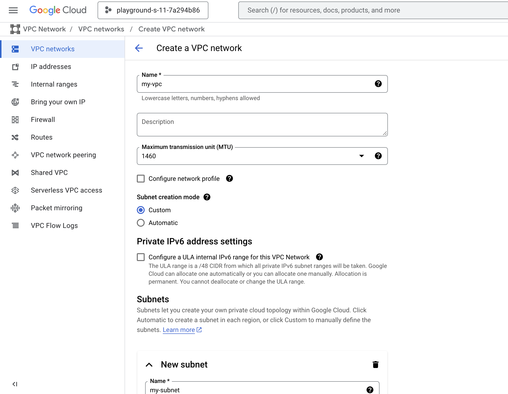
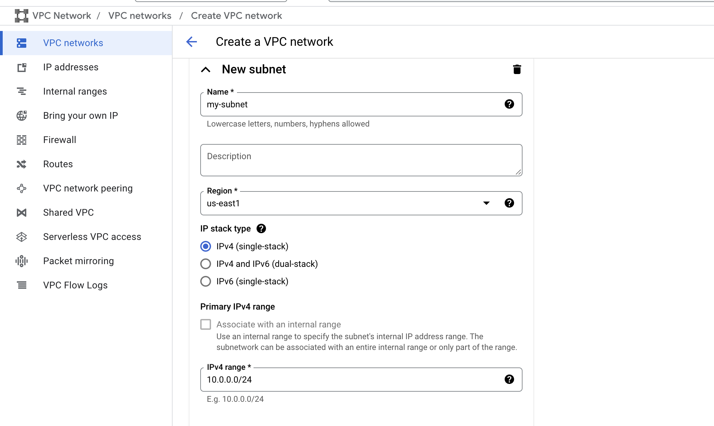
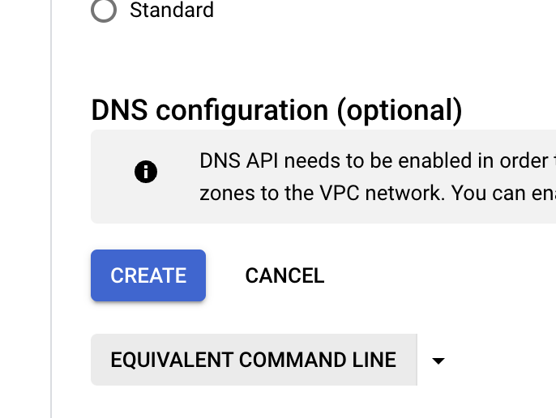
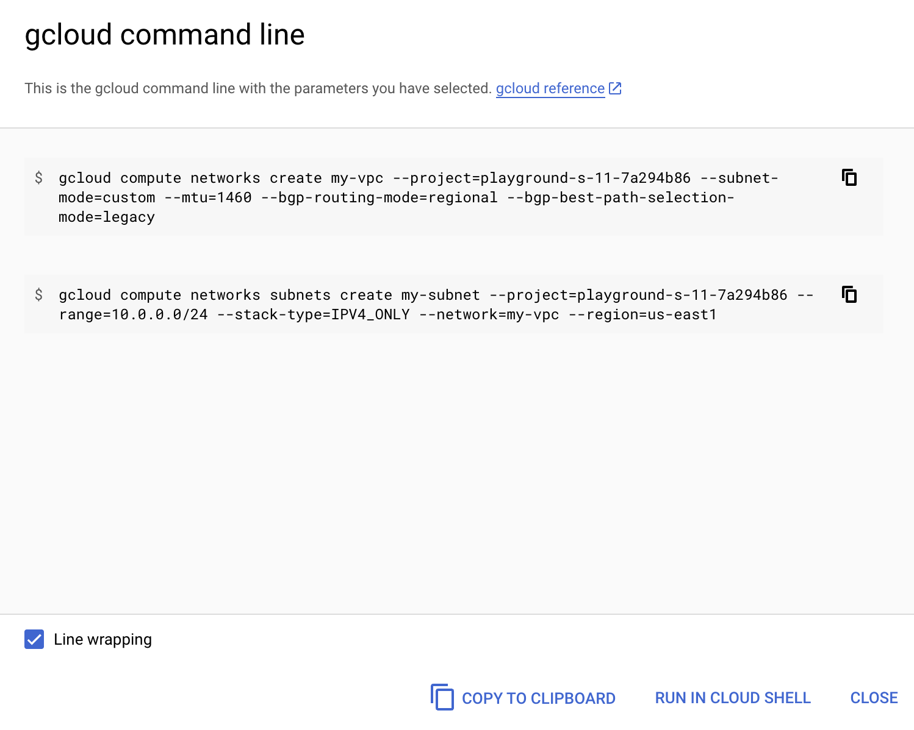
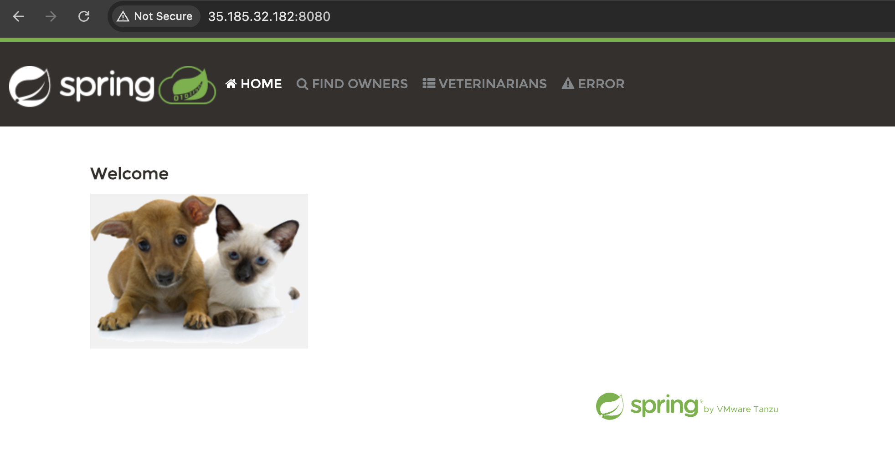

# Documentation

## Task
1. Write one or several bash scripts (using gcloud CLI) which:<br/>
    a) Create VPC, Subnet, Google Container Registry (GCR), VM, public IP address for VM, Firewall rules<br/>
    b) Push a java spring-petlinic container image you built in “Docker” module to GCR<br/>
    c) GCR should be private<br/>
    d) Install Docker on the VM <br/>
    e) Run container on the VM <br/>
2. Verify that application is accessible in your browser
3. Remove resources
<br/>

Step 1 <br/>
Open Grid Dynamics project in GCP <br/>
https://console.cloud.google.com/welcome?cloudshell=true&inv=1&invt=AbpiTg&project=gd-gcp-internship-devops

Open Cloud Shell with the button with termianl icon on the right top of the header. <br/>
Create 4 bash files with following command.
```
touch create_resources.sh create_gar.sh run_container.sh remove.sh
```
Get the content of scripts from this links(Go to editor with ``Open Editor`` button):<br/>
create_resources.sh -> [create_resources](https://github.com/nlopatin-gd/mavoyan-internship/blob/gcp/GCP/create_resources.sh)
<br/>
create_gar.sh -> [create_gar](https://github.com/nlopatin-gd/mavoyan-internship/blob/gcp/GCP/create_gar.sh)
<br/>
run_container.sh -> [run_container](https://github.com/nlopatin-gd/mavoyan-internship/blob/gcp/GCP/run_container.sh)
<br/>
remove.sh -> [remove](https://github.com/nlopatin-gd/mavoyan-internship/blob/gcp/GCP/remove.sh)
<br/>
Go back to the terminal<br/>
Clone repository:
```
git clone https://github.com/avmang/spring-petclinic.git
```
Run following commands in Google Cloud Shell
```
bash create_resources.sh 
bash create_gar.sh 
gcloud compute instances start mavoyan-vm --zone us-east1-b
bash run_container.sh 
```
NOTE: Rerun scripts in case of failures(especially
un_container.sh) or use the following script to start VM.
```
gcloud compute instances start mavoyan-vm --zone us-east1-b
```
(We are doing this because VM turning off while the build process)
### Steps to help you write scripts easier:

Make resources with GCP console like this:



Scroll down to find ``EQUIVALENT COMMAND LINE`` button and click on that:

Take commands for your script:


## Step 2 (Result)
To see the result, find the external IP for your VM.<br>
You can use this command for finding IP. 
```
gcloud compute instances describe mavoyan-vm --zone us-east1-b --format 'get(networkInterfaces[0].accessConfigs[0].natIP)'
```

Open on your browser ``<EXTERNAL_IP>:8080``


## Step 3
To remove resources run this commnad:
```
bash remove.sh
```
The End!