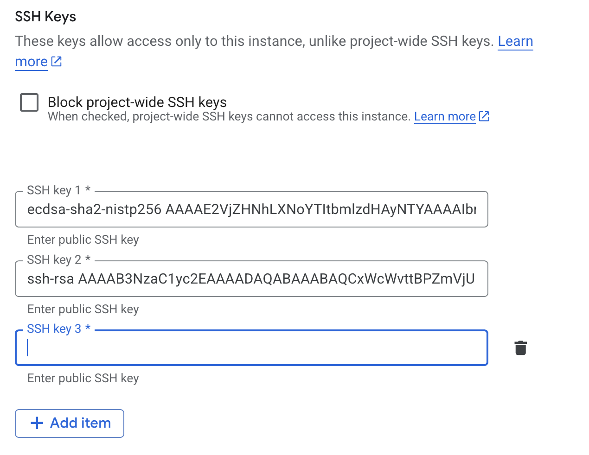
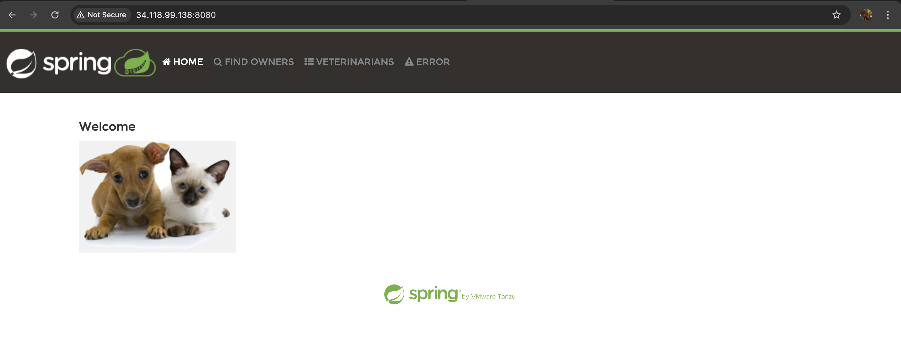

# Documentation

## The task

Use the documentation provided in the Learning Plan to complete the task above::

1. Create ansible inventory with information about hosts
2. Create ansible playbook for deploying spring-petclinic application. It should include:
Installing required software depending of application artifact (java based or docker based)
Taking a specific artifact version (jar file/docker image) from a local machine or Nexus and deploying it to the application server.
3. Deploy application to remote host with ansible
4. Check results in browser

### Steps

Preparing necessary files

[Configuration file](https://github.com/nlopatin-gd/mavoyan-internship/blob/ansible/ansible/ansible.cfg)

In this file we define dynmaic infentory file, remote host username, private key path to make ansible able to connect to the host, and python interpreter.

[Inventory file](https://github.com/nlopatin-gd/mavoyan-internship/blob/ansible/ansible/hosts-dev)

In this file we define our hosts (in this situation one host)

[Playbook file](https://github.com/nlopatin-gd/mavoyan-internship/blob/ansible/ansible/deploy.yaml)
 
In this file we define all steps that ansible should do on host machine. <br/>
Steps are:
1. Update apt cache
2. Install Docker
3. Start Docker
4. Pull Docker image from Docker Hub
5. Run Image
6. Wait for application to start
7. Check application status 
8. Print application response

It pulls ``<your_username>/ansible-spring-multiplatform`` docker image.

And to make that image clone this repository
```
git clone git@github.com:avmang/spring-petclinic.git
```
And checkout to needed commit
```
git checkout 3e649cf
```
Build an image with buildx to make that multiplatform:
```
docker buildx build --platform linux/amd64,linux/arm64 -t ansible-spring-multiplatform:latest .
```
Tag the image(change username):
```
 docker tag ansible-spring-multiplatform:latest <your_username>/ansible-spring-multiplatform
```
Login to Dockerhub 
```
docker login
```
Push the image
```
docker push <your_username>/ansible-spring-multiplatform
```

We also need host machine to deploy the app on. For that we create GCE in GCP.


Take the external ip and write instead of <EXTERNAL_IP> in [Inventory file](https://github.com/nlopatin-gd/mavoyan-internship/blob/ansible/ansible/hosts-dev) 
To add ssh key to that vm ssh into that once, then genereate ssh key in local machine.
```
ssh-keygen -t rsa
```
Copy public key
```
cat <path_to_public_key>
```
Add the key to the VM (edit->ssh keys->add item)

Change the username and public key path in [Configuration file](https://github.com/nlopatin-gd/mavoyan-internship/blob/ansible/ansible/ansible.cfg). Make sure that the username is the same as in the end of public key.
To run playbook
```
anible-playbook deploy.yaml
```
Result:

Visit ``<EXTERNAL_IP>:8080`` to see the web page
