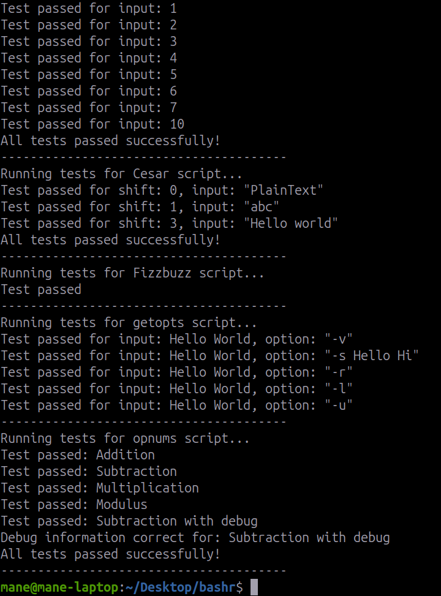

# Usage

To make all files executable
```
find . -type f -name "*.sh" -exec chmod +x {} \;
```
## 1. Fibonacci

```
./fibonacci.sh
```
After executing script you should provide number then get answer.
## 2. Fizzbuzz
```
./fizzbuzz.sh
```
## 3. Cesar
```
./cesar.sh -s "shift" -i "input_file" -o "output_file"
```
## 4. Getopts
```
./getopts.sh -i "input_file" -o "output_file" -v
```
```
./getopts.sh -i "input_file" -o "output_file" -s "word1" "word2"
```
```
./getopts.sh -i "input_file" -o "output_file" -l
```
```
./getopts.sh -i "input_file" -o "output_file" -r
```
```
./getopts.sh -i "input_file" -o "output_file" -u
```

## 5. Opnum
```
./opnum.sh -o "+" -n 1 2 3 4 5 
```
Change numbers and operation as you want.
<br/>
For debug mode
```
./opnum.sh -o "+" -n 1 2 3 4 5 -d
```
## 6. Report

```
./report.sh
```

# Screenshots



