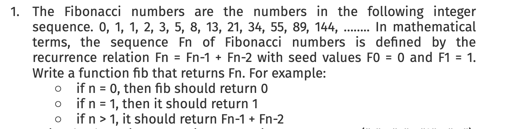

# Usage

To make all files executable
```
find . -type f -name "*.sh" -exec chmod +x {} \;
```
## 1. Fibonacci

Link to script -> [Fibonacci Script](https://github.com/nlopatin-gd/mavoyan-internship/blob/bash/bash/1_fibonacci.sh)
```
./1_fibonacci.sh
```
After executing script you should provide number then get answer.

<<<<<<< HEAD
Result:


=======
>>>>>>> 3023404 (Fixed README)
## 2. Opnum

Link to script -> [ Script](https://github.com/nlopatin-gd/mavoyan-internship/blob/bash/bash/2_opnum.sh)
```
./2_opnum.sh -o "+" -n 1 2 3 4 5 
```
Change numbers and operation as you want.
<br/>
For debug mode
```
./2_opnum.sh -o "+" -n 1 2 3 4 5 -d
```

Result:


## 3. Fizzbuzz

Link to script -> [ Script](https://github.com/nlopatin-gd/mavoyan-internship/blob/bash/bash/3_fizzbuzz.sh)
```
./3_fizzbuzz.sh
```
Result:


## 4. Cesar

Link to script -> [ Script](https://github.com/nlopatin-gd/mavoyan-internship/blob/bash/bash/4_cesar.sh)
```
./4_cesar.sh -s "shift" -i "input_file" -o "output_file"
./4_cesar.sh -s "shift" -i a.txt -o b.txt
```
Result:


## 5. Getopts

Link to script -> [ Script](https://github.com/nlopatin-gd/mavoyan-internship/blob/bash/bash/5_getopts.sh)
```
./5_getopts.sh -i "input_file" -o "output_file" -v
./5_getopts.sh -i a.txt -o b.txt -v
```
```
./5_getopts.sh -i "input_file" -o "output_file" -s "word1" "word2"
./5_getopts.sh -i a.txt -o b.txt -s "word1" "word2"
```
```
./5_getopts.sh -i "input_file" -o "output_file" -l
./5_getopts.sh -i a.txx -o b.txt -l
```
```
./5_getopts.sh -i a.txt -o b.txt -r
```
```
./5_getopts.sh -i a.txt -o b.txt -u
```
Result:


## 6. Report

Link to script -> [ Script](https://github.com/nlopatin-gd/mavoyan-internship/blob/bash/bash/6_report.sh)
```
./6_report.sh
```
Result:


# Testing

```
./testing.sh
```


