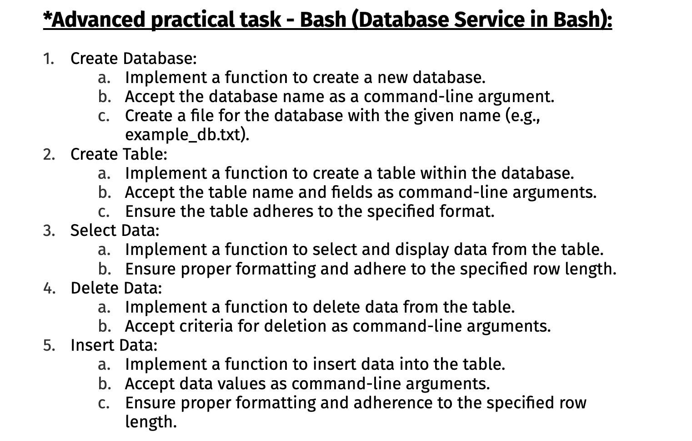
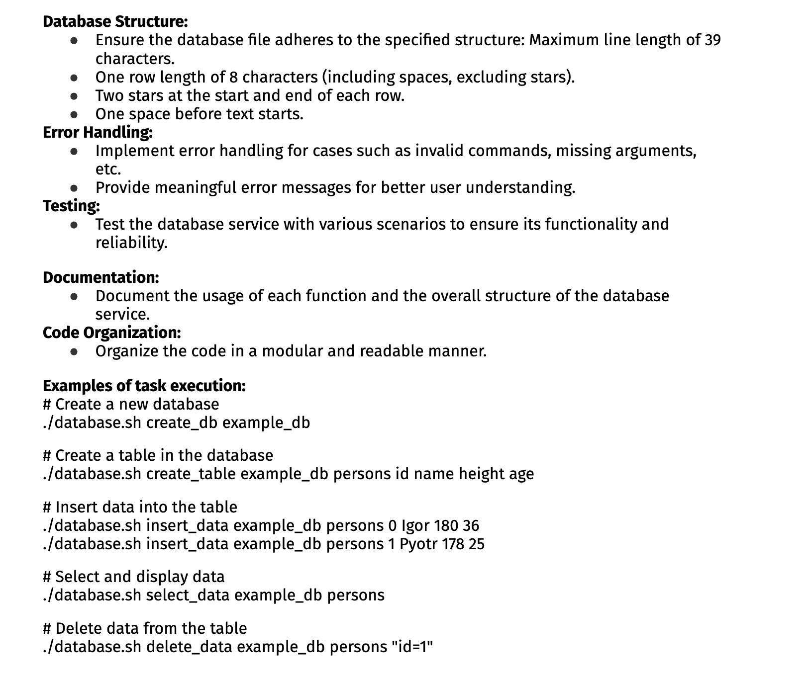
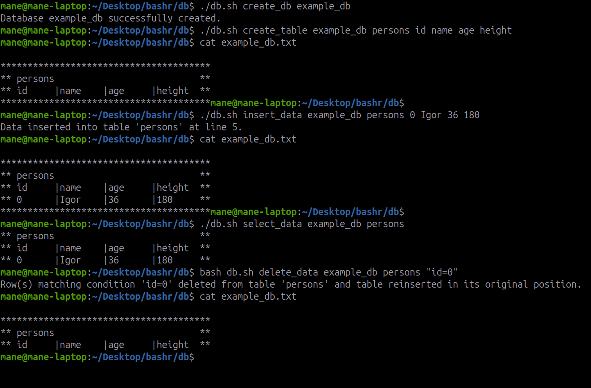
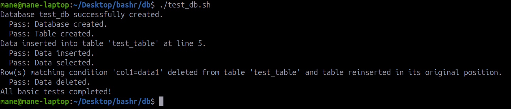

# Usage of DB

## Description




To create database

```
./db.sh create_db example_db
```
To create table 
```
./db.sh create_table example_db persons id name age height
```
To insert data
```
./db.sh insert_data example_db persons 0 Igor 36 180

```
To select data
```
./db.sh select_data example_db persons
```
To delete data 
```
bash db.sh delete_data example_db persons "id=0"
```

# Screenshots




