# Documentation

## Task 1

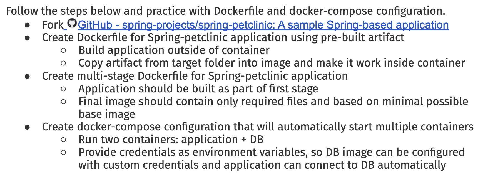

### Steps

At first we need to fork this repository <br/>
https://github.com/spring-projects/spring-petclinic/

And clone that to our local machine <br/>
```
git clone git@github.com:<username>/spring-petclinic.git
```
For cloning my project (but I've alredy done changes)
```
git@github.com:avmang/spring-petclinic.git
```

<br/>

Create Dockerfile for Spring-petclinic application using pre-built artifact
Build application outside of container
Copy artifact from target folder into image and make it work inside container

->For this step we should go to our cloned repository and create a Dockerfile
```
cd spring-petclinic/
touch Dockerfile
```
And we need to add content to that file 
```
vim Dockerfile
```
The content:
```
FROM eclipse-temurin:17-jdk-alpine 

WORKDIR /build

COPY target/spring-petclinic-4.0.1-SNAPSHOT.jar /build/app.jar

EXPOSE 8080

CMD ["java", "-jar", "/build/app.jar"]
```

Now for making image from this Dockerfile we should use this command

```
docker build --platform linux/amd64 -t spring-app1 . #for MacOs
docker build  -t spring-app1 . #for Linux
```
Lets fix the size of the image
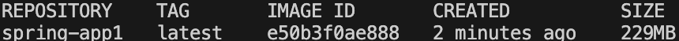
The command for running container
```
docker run -p 8080:8080 spring-app1
```
To see the result visit http://localhost:8080/
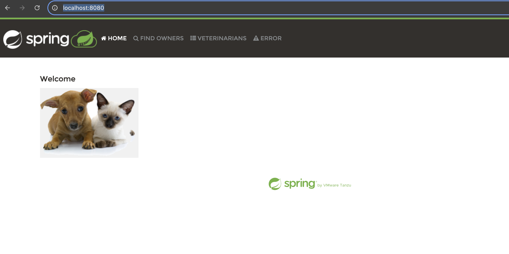

<br/>

Create multi-stage Dockerfile for Spring-petclinic application
Application should be built as part of first stage
Final image should contain only required files and based on minimal possible base image

->For this part we should change te content of Dockerfile

```
FROM eclipse-temurin:17-jdk AS build

WORKDIR /build

RUN apt-get update && apt-get install -y maven

COPY mvnw mvnw
COPY mvnw.cmd .
COPY .mvn .mvn
COPY pom.xml .
COPY src ./src

RUN ./mvnw clean package -DskipTests

FROM eclipse-temurin:17-jdk AS runtime

WORKDIR /app

COPY --from=build /build/target/spring-petclinic-*.jar /app/app.jar

EXPOSE 8080

CMD ["java", "-jar", "/app/app.jar"]
```

Build command:
```
docker build -t spring-app2 .
```
The image size
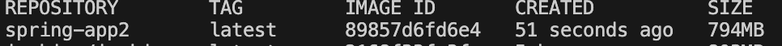

The command for running container
```
docker run -p 8080:8080 spring-app2
```
To see the result visit http://localhost:8080/

Create docker-compose configuration that will automatically start multiple containers
Run two containers: application + DB
Provide credentials as environment variables, so DB image can be configured with custom credentials and application can connect to DB automatically

->Docker Compose file already exists in project's directory, with DBs configurations.
So we only need to add application part with this snippet of yaml.
```
app:
    build: .
    ports:
    - 8080:8080
```
The whole ``docker-compose.yml`` file
```
services:
  app:
    build: .
    ports:
    - 8080:8080
  mysql:
    image: mysql:9.1
    ports:
      - "3306:3306"
    environment:
      - MYSQL_ROOT_PASSWORD=
      - MYSQL_ALLOW_EMPTY_PASSWORD=true
      - MYSQL_USER=petclinic
      - MYSQL_PASSWORD=petclinic
      - MYSQL_DATABASE=petclinic
    volumes:
      - "./conf.d:/etc/mysql/conf.d:ro"
  postgres:
    image: postgres:17.0
    ports:
      - "5432:5432"
    environment:
      - POSTGRES_PASSWORD=petclinic
      - POSTGRES_USER=petclinic
      - POSTGRES_DB=petclinic
```
Run with this command
```
docker compose up --build
```
Result:

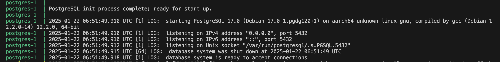
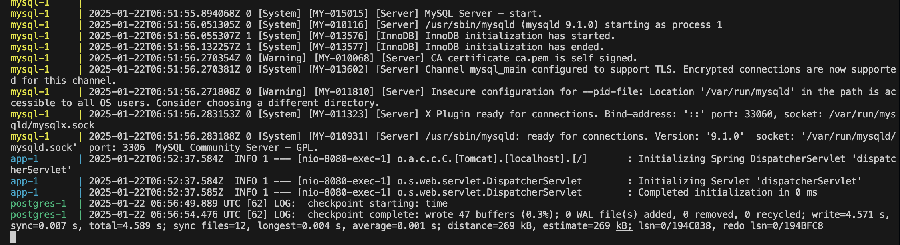

To see that in browser visit http://localhost:8080/

## Task 2

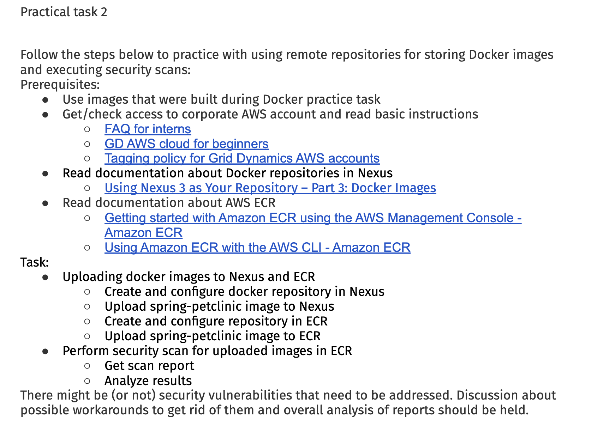
Links:
https://griddynamics.atlassian.net/wiki/spaces/GDIP/pages/1145472210/FAQ+for+interns
https://griddynamics.atlassian.net/wiki/spaces/IT/pages/172998/GD+AWS+cloud+for+beginners
https://griddynamics.atlassian.net/wiki/spaces/IT/pages/873627729/Tagging+policy+for+Grid+Dynamics+AWS+accounts
https://www.sonatype.com/blog/using-nexus-3-as-your-repository-part-3-docker-images
(not working)
https://docs.aws.amazon.com/AmazonECR/latest/userguide/getting-started-cli.html
https://docs.aws.amazon.com/AmazonECR/latest/userguide/getting-started-cli.html

### Steps
I have done all this steps on Linux kernel.<br/>
Create and configure docker repository in Nexus<br/>
-> At first we need to start the Nexus on our local machine. <br/>
Go to your directory where the Nexus is
```
cd nexus-3.76.0-03/bin
./nexus run
```
Sign in<br>
Create hosted repository for Docker images
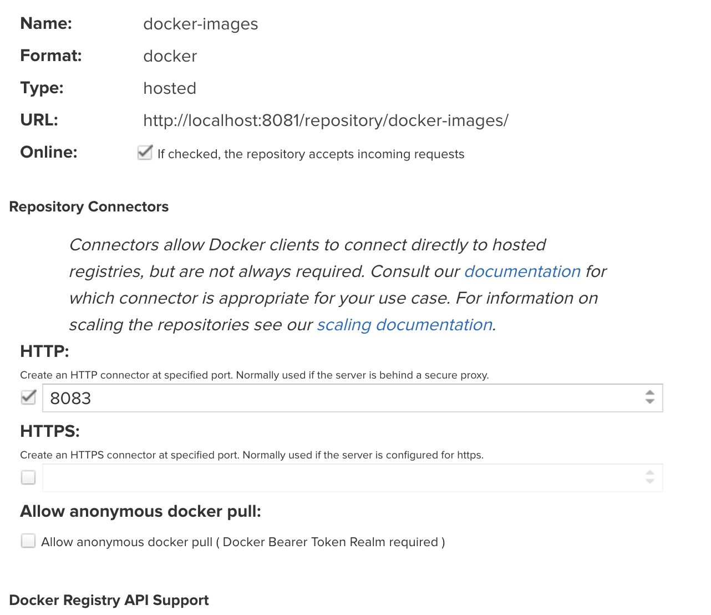
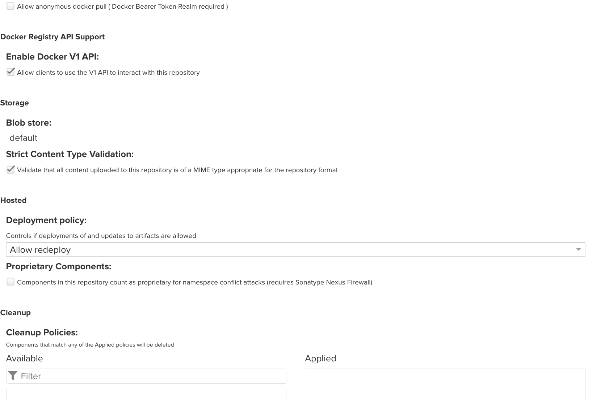
Login with docker
```
docker login localhost:8083
```
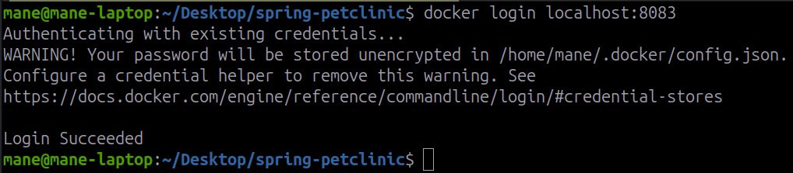
Tag images
```
docker tag spring-app1:latest localhost:8083/repository/docker-images/spring-app1:latest
docker tag spring-app2:latest localhost:8083/repository/docker-images/spring-app2:latest
```
Push images
```
docker push localhost:8083/repository/docker-images/spring-app1:latest
docker push localhost:8083/repository/docker-images/spring-app2:latest
```
the result 
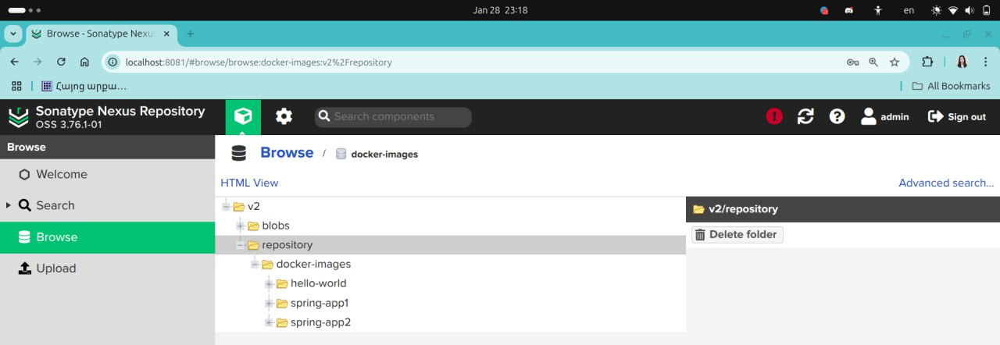


### ECR part


-- Create and configure repository in ECR <br/>
-- Upload spring-petclinic image to ECR

At first we need to have AWS CLI on our local machine. We can do this with following commands <br/>
For MacOs
```
curl "https://awscli.amazonaws.com/AWSCLIV2.pkg" -o "AWSCLIV2.pkg"
sudo installer -pkg AWSCLIV2.pkg -target /
curl "https://awscli.amazonaws.com/AWSCLIV2.pkg" -o "AWSCLIV2.pkg"
sudo installer -pkg ./AWSCLIV2.pkg -target /
```
For Linux 
```
curl "https://awscli.amazonaws.com/awscli-exe-linux-x86_64.zip" -o "awscliv2.zip"
unzip awscliv2.zip
sudo ./aws/install
```
Verify that
```
which aws
aws --version
```
Then we must configure awscli with this command and IAM credentials
```
aws configure
```
We need to create ECR repository on AWS
```
aws ecr create-repository --repository-name springapp --image-scanning-configuration scanOnPush=true
```
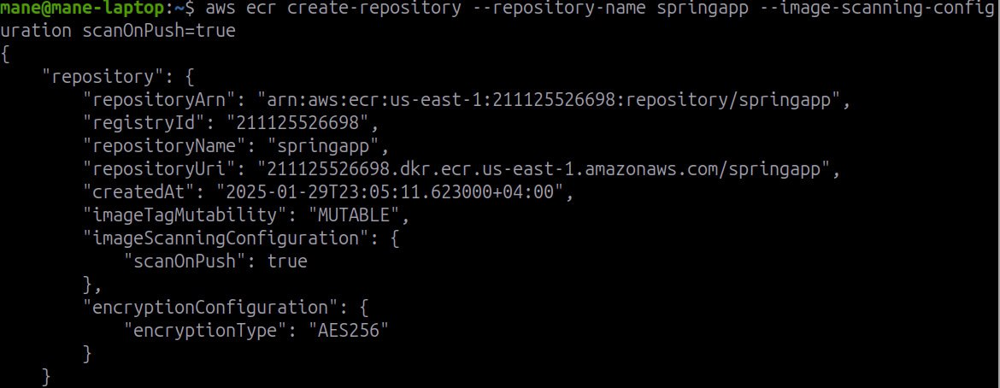
Login with your repository URI
```
aws ecr get-login-password --region us-east-1 | docker login --username AWS --password-stdin <your_repo_URI>/springapp
```
Tag the docker images
```
docker tag spring-app1:latest <your_repo_URI>/springapp:img1
docker tag spring-app2:latest <your_repo_URI>/springapp:img2
```
And push that to the ECR repository
```
docker push <your_repo_URI>/springapp:img1
docker push <your_repo_URI>/springapp:img2
```
Result
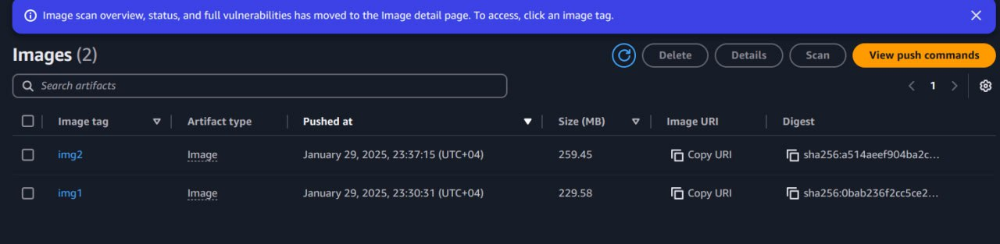
Scans:
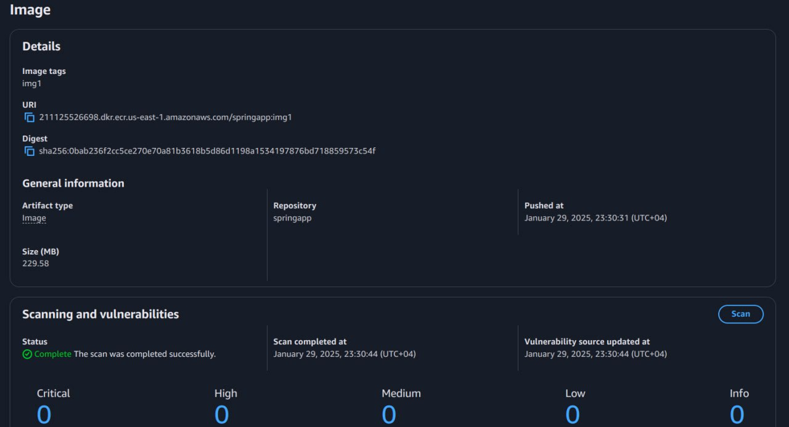
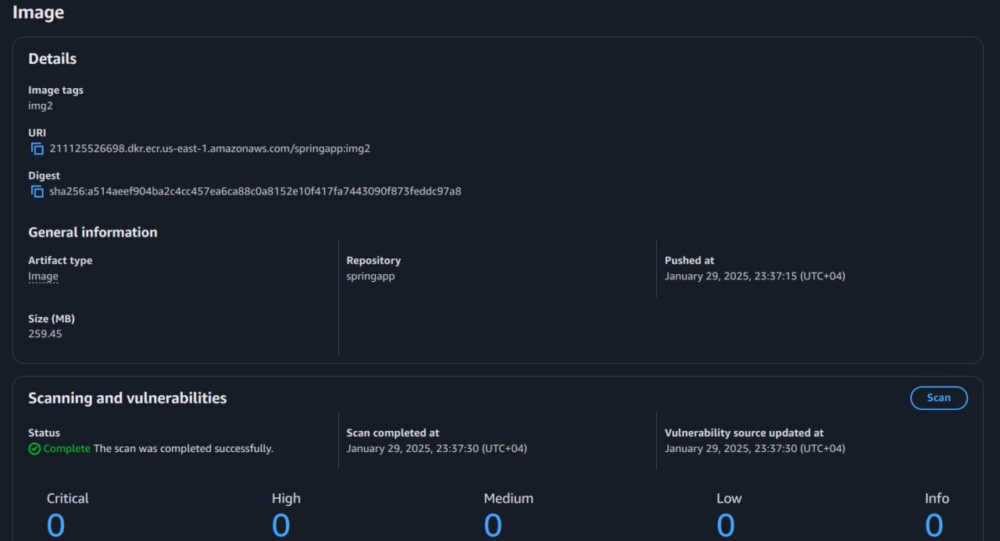
Scan results are completed successfully.
