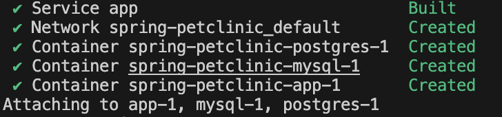

# Documentation

## Task 1


### Steps

At first we need to fork this repository <br/>
https://github.com/spring-projects/spring-petclinic/

And clone that to our local machine <br/>
```
git clone git@github.com:<username>/spring-petclinic.git
```
For cloning my project (but I've alredy done changes)
```
git@github.com:avmang/spring-petclinic.git
```

<br/>

Create Dockerfile for Spring-petclinic application using pre-built artifact
Build application outside of container
Copy artifact from target folder into image and make it work inside container

->For this step we should go to our cloned repository and create a Dockerfile
```
cd spring-petclinic/
touch Dockerfile
```
And we need to add content to that file 
```
vim Dockerfile
```
The content:
```
FROM eclipse-temurin:17-jdk-alpine 

WORKDIR /build

COPY target/spring-petclinic-4.0.1-SNAPSHOT.jar /build/app.jar

EXPOSE 8080

CMD ["java", "-jar", "/build/app.jar"]
```

Now for making image from this Dockerfile we should use this command

```
docker buildx build --platform linux/amd64 -t spring-app1 .
```
Lets fix the size of the image

The command for running container
```
docker run -p 8080:8080 spring-app1
```
To see the result visit http://localhost:8080/


<br/>

Create multi-stage Dockerfile for Spring-petclinic application
Application should be built as part of first stage
Final image should contain only required files and based on minimal possible base image

->For this part we should change te content of Dockerfile

```
FROM eclipse-temurin:17-jdk AS build

WORKDIR /build

RUN apt-get update && apt-get install -y maven

COPY mvnw mvnw
COPY mvnw.cmd .
COPY .mvn .mvn
COPY pom.xml .
COPY src ./src

RUN ./mvnw clean package -DskipTests

FROM eclipse-temurin:17-jdk AS runtime

WORKDIR /app

COPY --from=build /build/target/spring-petclinic-*.jar /app/app.jar

EXPOSE 8080

CMD ["java", "-jar", "/app/app.jar"]
```

Build command:
```
docker build -t spring-app2 .
```
The image size


The command for running container
```
docker run -p 8080:8080 spring-app2
```
To see the result visit http://localhost:8080/

Create docker-compose configuration that will automatically start multiple containers
Run two containers: application + DB
Provide credentials as environment variables, so DB image can be configured with custom credentials and application can connect to DB automatically

->Docker Compose file already exists in project's directory, with DBs configurations.
So we only need to add application part with this snippet of yaml.
```
app:
    build: .
    ports:
    - 8080:8080
```
The whole ``docker-compose.yml`` file
```
services:
  app:
    build: .
    ports:
    - 8080:8080
  mysql:
    image: mysql:9.1
    ports:
      - "3306:3306"
    environment:
      - MYSQL_ROOT_PASSWORD=
      - MYSQL_ALLOW_EMPTY_PASSWORD=true
      - MYSQL_USER=petclinic
      - MYSQL_PASSWORD=petclinic
      - MYSQL_DATABASE=petclinic
    volumes:
      - "./conf.d:/etc/mysql/conf.d:ro"
  postgres:
    image: postgres:17.0
    ports:
      - "5432:5432"
    environment:
      - POSTGRES_PASSWORD=petclinic
      - POSTGRES_USER=petclinic
      - POSTGRES_DB=petclinic
```
Run with this command
```
docker compose up --build
```
Result:



