# Documentation

## The task

1. Download/install Tomcat server.
2. Verify that it works by visiting the root page.
    a. What ports are used by the java process?
3. Remove all default applications (including manager), restart Tomcat.
4. Download Jenkins WAR and deploy into Tomcat.
5. Verify that application works (visit application URL).
6. Enable JMX in Tomcat.
    a. What ports are used by the java process?
    b. Change CATALINA_OPTS to use same for RMI as for JMX
    c. What ports are used by the java process?
7. Rerun tomcat with min heap size 10M and max heap size 20M.
    a. What type of error will you get?
    b. Increase min heap size to 1G and max heap size to 3G, enable parallel garbage collector.
8. Connect by JConsole to Tomcat and look around.
9. Stop Tomcat.
10. Launch Jenkins WAR as a standalone application, verify that it works.

## Steps

1) Download/install Tomcat server. <br/>
    I have downloaded the tar.gz of Tomcat 10 and installed that.
    ```
    curl -O https://dlcdn.apache.org/tomcat/tomcat-10/v10.1.34/bin/apache-tomcat-10.1.34.tar.gz
    tar -xzvf apache-tomcat-10.1.34.tar.gz
    ```
2) Verify that it works by visiting the root page. <br/>
    I have started the Tomcat with the startup.sh script.
    ```
    cd apache-tomcat-10.1.34/bin
    bash startup.sh
    ```
    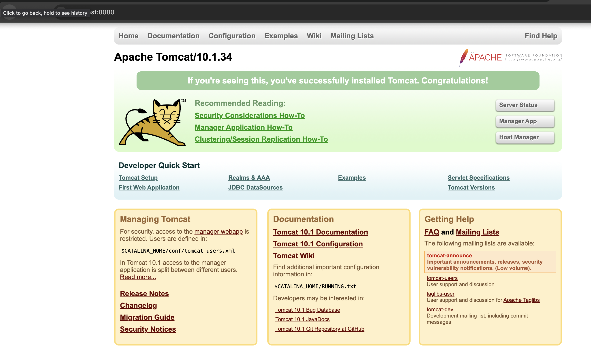
    <br/>
    a. What ports are used by the java process?
    ```
    ps aux | grep java
    lsof -i -n -P | grep java
    ```
    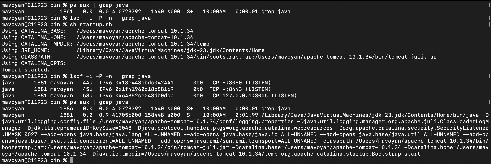
3) Remove all default applications (including manager), restart Tomcat.
    ```
    cd ../webapps
    rm -rf docs examples host-manager manager
    cd ../bin
    ```
    <br/>
    For restarting tomcat(in bin directory): 
    <br/>
    ``` 
    bash shutdown.sh && bash startup.sh 
    ```
4) Download Jenkins WAR and deploy into Tomcat.
    <br/>
    Downloaded Jenkins WAR from Jenkins site, moved that to apache-tomcat-10.1.34/webapps
    ```
    cd ../webapps
    curl -O https://get.jenkins.io/war-stable/2.479.3/jenkins.war
    ```
   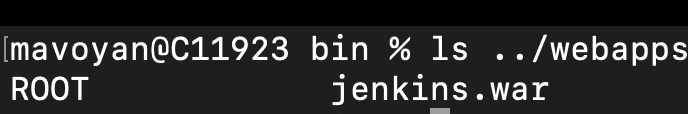
5) Verify that application works (visit application URL).
    <br/>
    Starting Tomcat and visiting localhost:8080/jenkins
    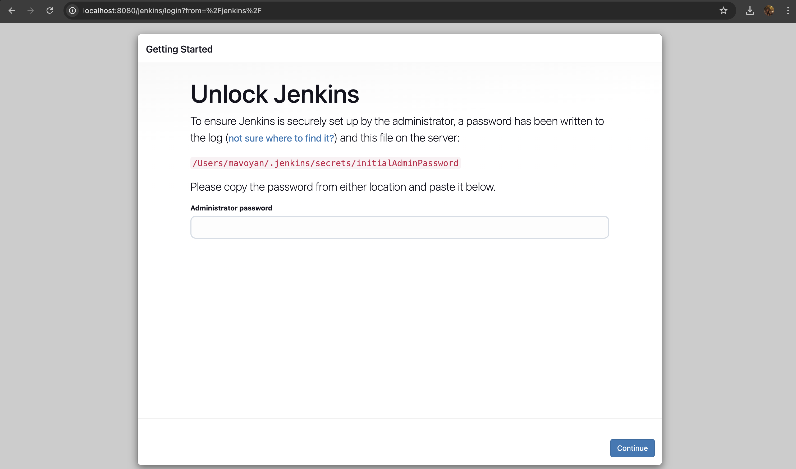

6) Enable JMX in Tomcat.
    <br/>
    For this point I have created setenv.sh file:
    ``` touch setenv.sh && chmod 755 setenv.sh ```
    ```
        echo '#!/bin/sh

    CATALINA_OPTS="-Dcom.sun.management.jmxremote \
    -Dcom.sun.management.jmxremote.port=9000 \
    -Dcom.sun.management.jmxremote.ssl=false \
    -Dcom.sun.management.jmxremote.authenticate=false \"' > setenv.sh

    ```
    With this we setting the port for jmx to 9000 and disabling ssl and authentication.
    (I've used this documentation https://geekflare.com/dev/enable-jmx-tomcat-to-monitor-administer/)
    
    <br/>
    And then opened Monitoring and Managment console, using 
    ``` 
    cd /usr/bin
    ./jconsole.sh
    ```

    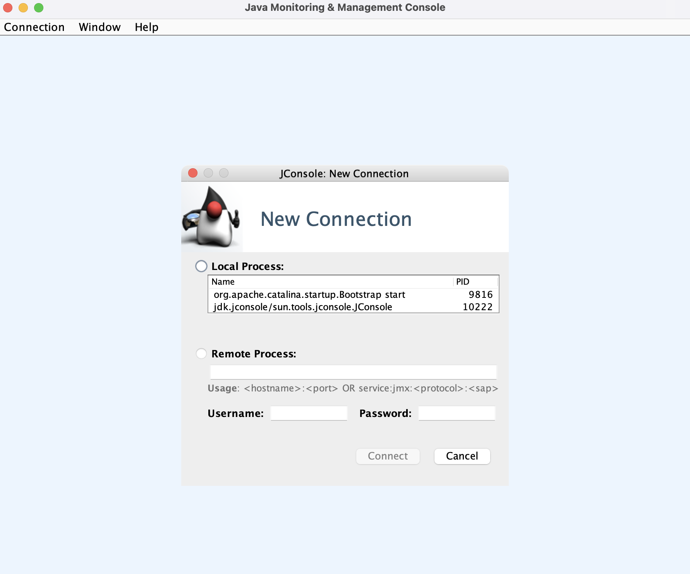
    <br/>
    Connected with remote process using my localhost:9000
    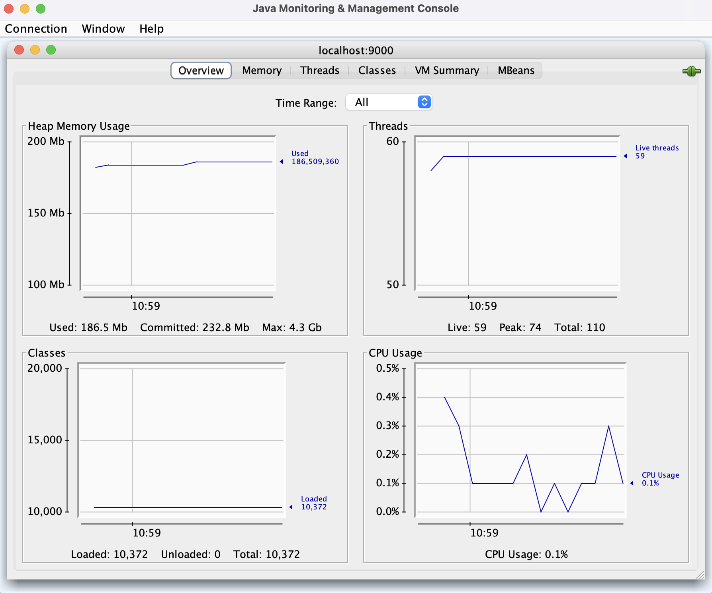
    <br/>
    a. What ports are used by the java process?
    ```
    lsof -i -n -P | grep java
    ```
    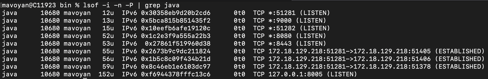
    <br/>
    b. Change CATALINA_OPTS to use same for RMI as for JMX
    <br/>
    c. What ports are used by the java process?
    <br/>
    Added following to my setenv.sh 

    ```
    -Djava.rmi.server.hostname=localhost \
    -Dcom.sun.management.jmxremote.rmi.port=9000
    ```
    The whole picture

    ```
    #!/bin/sh

    CATALINA_OPTS="-Dcom.sun.management.jmxremote \
    -Dcom.sun.management.jmxremote.port=9000 \
    -Dcom.sun.management.jmxremote.ssl=false \
    -Dcom.sun.management.jmxremote.authenticate=false \
    -Djava.rmi.server.hostname=localhost \
    -Dcom.sun.management.jmxremote.rmi.port=9000"
    ```

    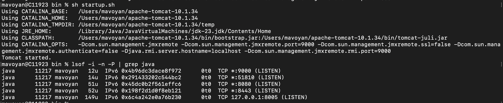

7. Rerun tomcat with min heap size 10M and max heap size 20M.
    Shutdown the Tomcat: ``` bash shutdown.sh ```
    <br/>
    Added following to my setenv.sh

    ```
    echo 'CATALINA_OPTS="$CATALINA_OPTS -Xms10m"
    CATALINA_OPTS="$CATALINA_OPTS -Xmx20m"
    export CATALINA_OPTS' >> setenv.sh
    ```
    <br/>
    a. What type of error will you get?
    <br/>
    ``` 
    SEVERE [Jenkins initialization thread] hudson.util.BootFailure.publish Failed to initialize Jenkins
    
    Caused by: java.lang.OutOfMemoryError: Java heap space

    ```
    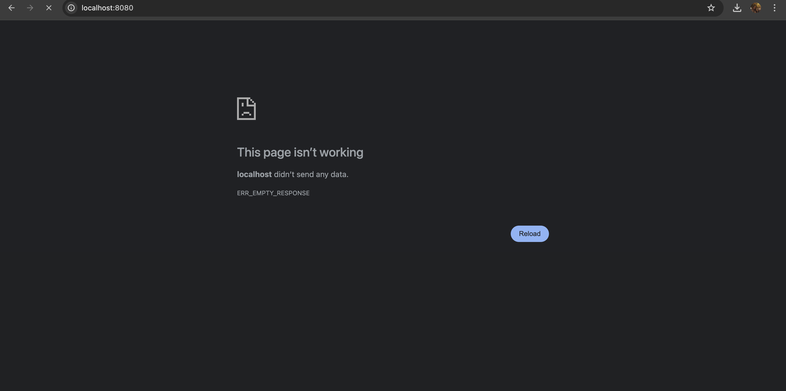
    <br/>
    b. Increase min heap size to 1G and max heap size to 3G, enable parallel garbage collector.

    <br/>
    My setenv.sh:
    
    ```
    #!/bin/sh

    CATALINA_OPTS="-Dcom.sun.management.jmxremote \
    -Dcom.sun.management.jmxremote.port=9000 \
    -Dcom.sun.management.jmxremote.ssl=false \
    -Dcom.sun.management.jmxremote.authenticate=false \
    -Djava.rmi.server.hostname=localhost \
    -Dcom.sun.management.jmxremote.rmi.port=9000"

    CATALINA_OPTS="$CATALINA_OPTS -Xms1g"
    CATALINA_OPTS="$CATALINA_OPTS -Xmx3g"
    CATALINA_OPTS="$CATALINA_OPTS -XX:+UseParallelGC"
    export CATALINA_OPTS 
    ```

8. Connect by JConsole to Tomcat and look around.
    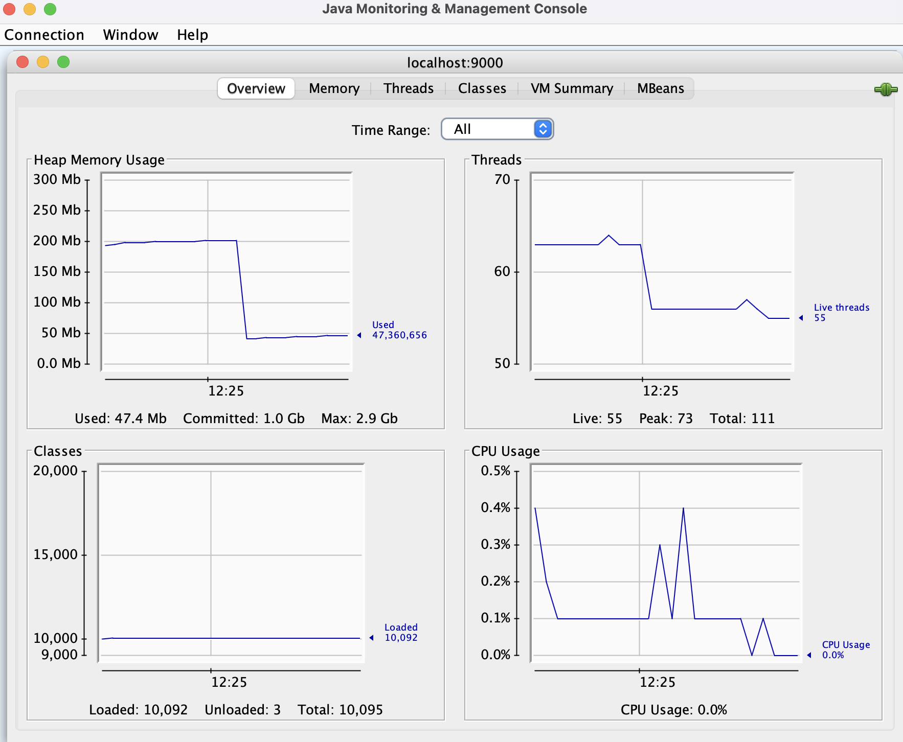
    <br/>
    The Garbage collector: 
    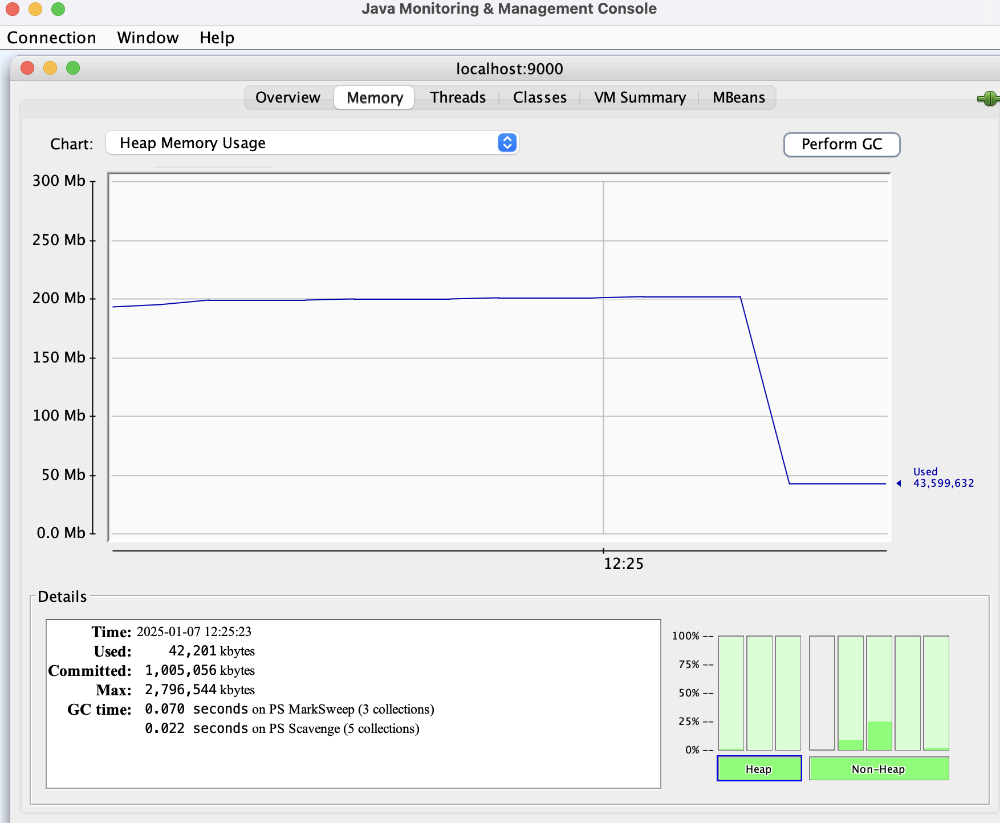

10. Launch Jenkins WAR as a standalone application, verify that it works.

    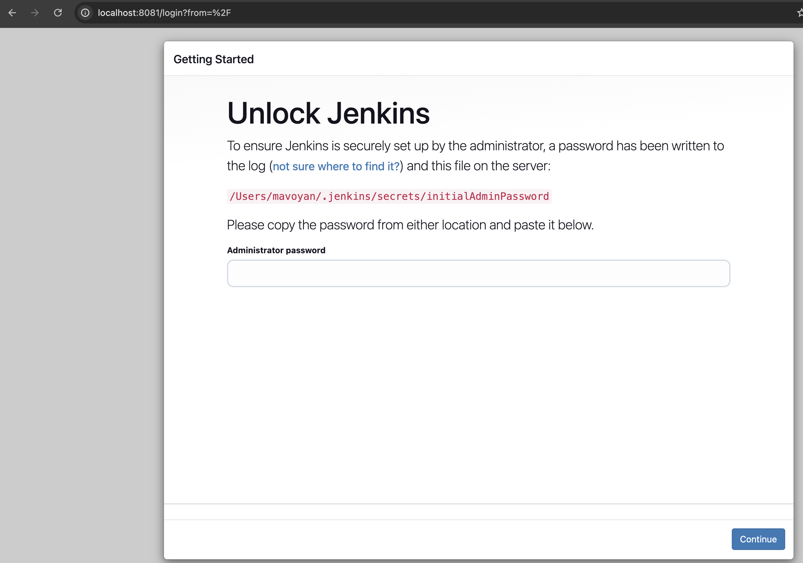


