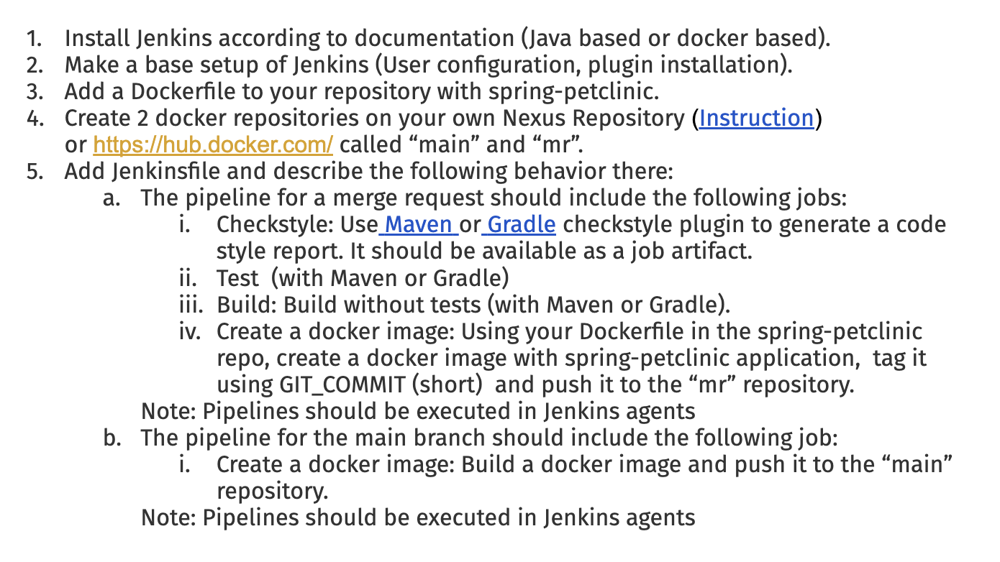
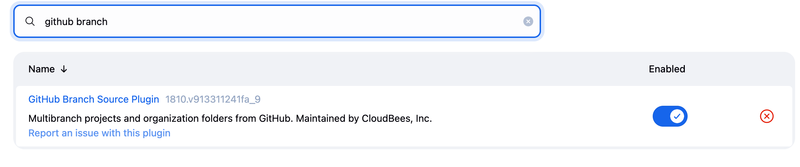
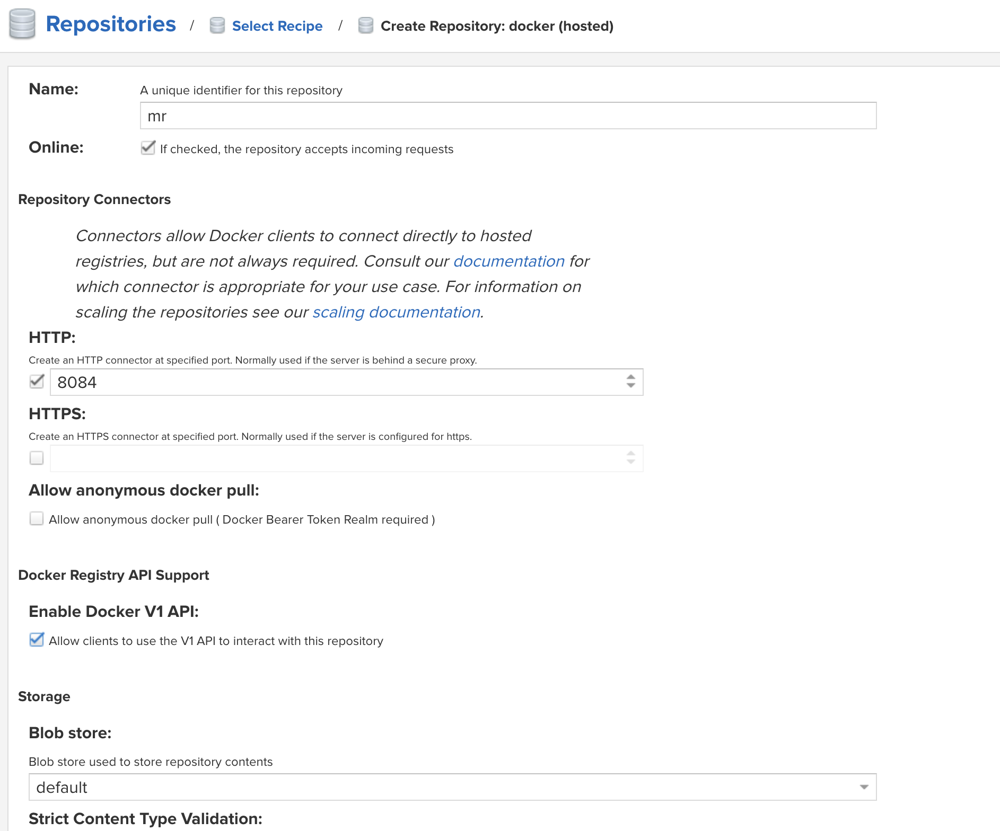
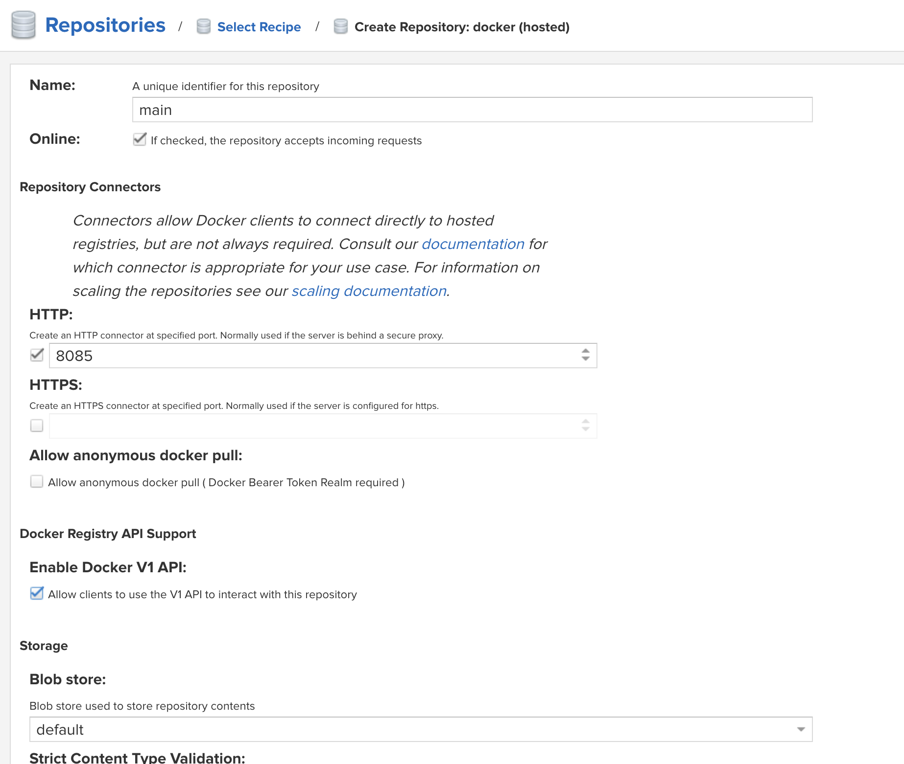
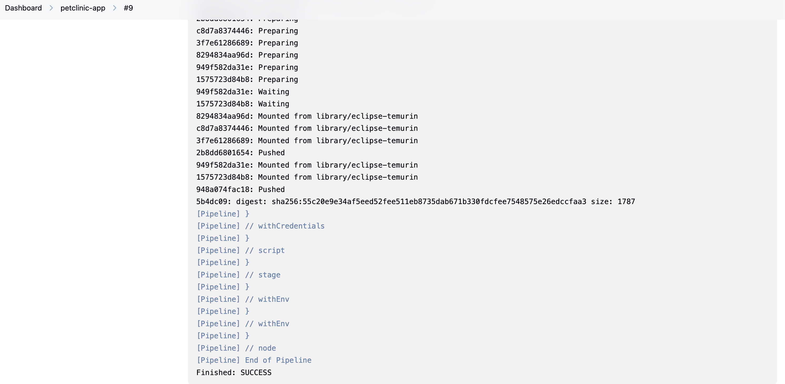
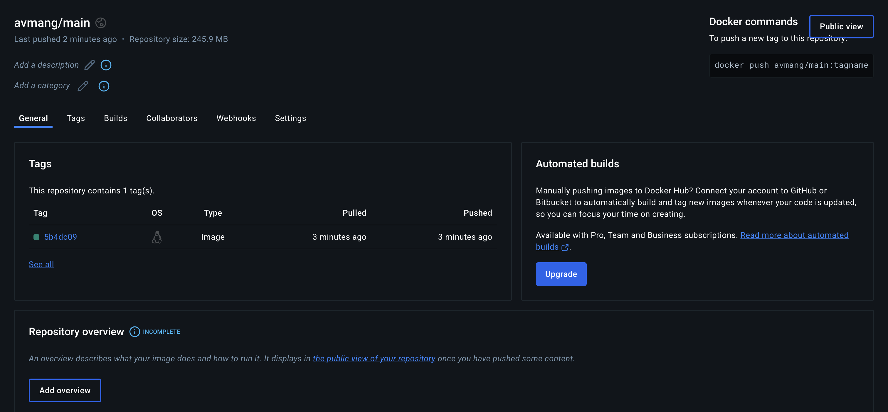
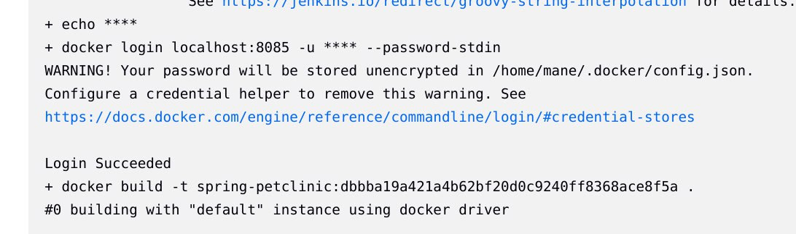
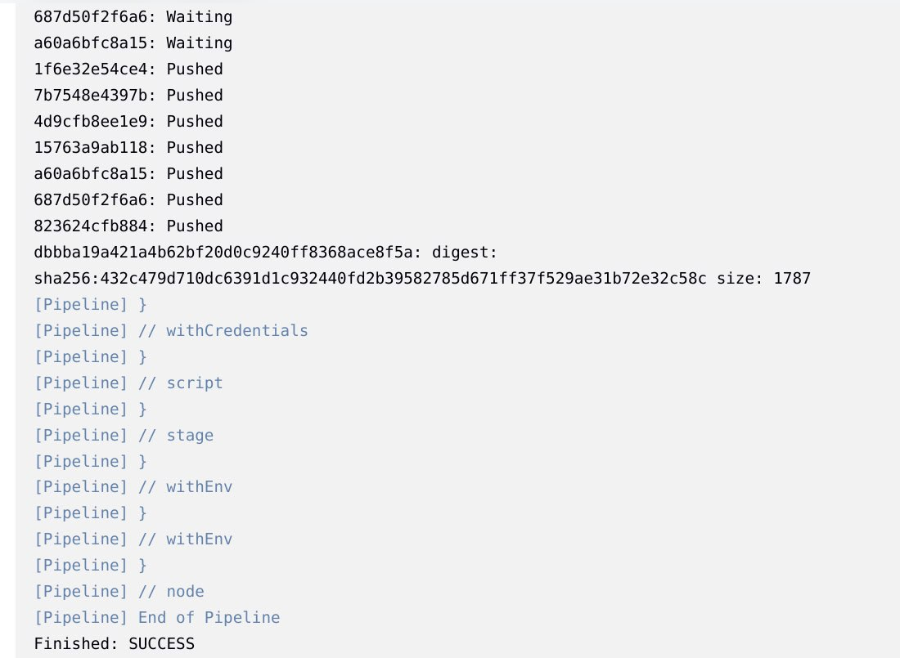
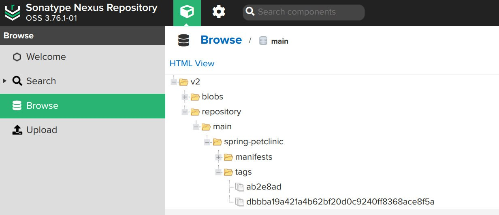

# Documentation

## Task



### Steps

Download jenkins.war file 

```
wget https://updates.jenkins.io/latest/jenkins.war
```

Start Jenkins
```
java -jar jenkins.war
```
Cat and copy the admin password for jenkins(or find with logs)
```
cat /var/jenkins_home/secrets/initialAdminPassword
```
Open Jenkins on ``localhost:8080``


Ensure the ``GitHub Branch Source Plugin`` is installed.<br/>

If it's not installed, add it from the available plugin list.

Fork the following repository and clone it.
https://github.com/avmang/spring-petclinic.git
```
git clone git@github.com:<your_username>/spring-petclinic.git
```
If you don't already have it, add a Dockerfile with the following content:
```
FROM eclipse-temurin:17-jdk AS build

WORKDIR /build

RUN apt-get update && apt-get install -y maven

COPY pom.xml .
COPY src ./src

RUN mvn clean package -DskipTests

FROM eclipse-temurin:17-jdk AS runtime

WORKDIR /build

COPY --from=build /build/target/spring-petclinic-*.jar app.jar

EXPOSE 8080

CMD ["java", "-jar", "app.jar"]
```

Run Nexus (If you want to use Docker Hub find configurations below)

```
./nexus run
```
Login to Nexus, go to ``Repository->Repositories`` and add 2 hosted docker repositories: ``main`` and ``mr``




In Jenkins: <br/> 
Click on ``New Item``<br/>
Name the project ``petclinic-app``<br/>
Choose Pipeline
In definition part choose Pipeline script from SCM<br/>
Choose git as SCM<br/>
In Repository Url field fill your repository link: https://github.com/<your_username>/spring-petclinic.git <br/>
Chnage ``Branch Specifier`` to */main

Add a Jenkinsfile with the following content: (For Nexus)

```
pipeline {
    agent any

    environment {
        REPO_MR = "mr"
        REPO_MAIN = "main"
        IMAGE_NAME = "spring-petclinic"
    }

    stages {
        stage ('Checkout') {
            when {
                expression { env.CHANGE_ID != null }
            }
            steps {
                checkout scm
            }
        }

        stage ('Checkstyle') {
            when {
                expression { env.CHANGE_ID != null }
            }
            steps {
                script {
                    sh 'mvn checkstyle:checkstyle'
                }
            }
            post {
                always {
                    archiveArtifacts artifacts: '**/checkstyle-result.xml'
                }
            }
        }

        stage ('Test') {
            when {
                expression { env.CHANGE_ID != null }
            }
            steps {
                script {
                    sh 'mvn test'
                }
            }
        }

        stage ('Build') {
            when {
                expression { env.CHANGE_ID != null }
            }
            steps {
                script {
                    sh 'mvn clean install -DskipTests'
                }
            }
        }

        stage ('Docker Image for MR') {
            when {
                expression { env.CHANGE_ID != null }
            }
            steps {
                script {
                    def shortCommit = env.GIT_COMMIT.substring(0, 7)
                    withCredentials([usernamePassword(
                        credentialsId: 'docker-credentials',
                        usernameVariable: 'DOCKER_CREDS_USR',
                        passwordVariable: 'DOCKER_CREDS_PSW'
                    )]) {
                        sh """
                        echo "${DOCKER_CREDS_PSW}" | docker login localhost:8084 -u "${DOCKER_CREDS_USR}" --password-stdin
                        docker build -t ${IMAGE_NAME}:${shortCommit} .
                        docker tag ${IMAGE_NAME}:${shortCommit} localhost:8084/repository/${REPO_MR}/${IMAGE_NAME}:${shortCommit}
                        docker push localhost:8084/repository/${REPO_MR}/${IMAGE_NAME}:${shortCommit}
                        """
                    }
                }
            }
        }

        stage ('Docker Image for main branch') {
            when {
                expression {
                    env.BRANCH_NAME == 'origin/main' || env.GIT_BRANCH?.contains('main')
                }
            }
            steps {
                script {
                    def shortCommit = env.GIT_COMMIT.substring(0, 7)
                    withCredentials([usernamePassword(
                        credentialsId: 'docker-credentials',
                        usernameVariable: 'DOCKER_CREDS_USR',
                        passwordVariable: 'DOCKER_CREDS_PSW'
                    )]) {
                        sh """
                        echo "${DOCKER_CREDS_PSW}" | docker login localhost:8085 -u "${DOCKER_CREDS_USR}" --password-stdin
                        docker build -t ${IMAGE_NAME}:${shortCommit} .
                        docker tag ${IMAGE_NAME}:${shortCommit} localhost:8085/repository/${REPO_MAIN}/${IMAGE_NAME}:${shortCommit}
                        docker push localhost:8085/repository/${REPO_MAIN}/${IMAGE_NAME}:${shortCommit}
                        """
                    }
                }
            }
        }
    }
}
```
In Jenkins add credentials with this steps <br/>
Manage Jenkins -> Credentials -> System -> Global credentials (unrestricted) -> Add credentials <br/>
Kind -> Username with password <br/>
Add your Nexus username and password, click treat username as secret.<br/>
(If you are using Docker Hub generate token and past that as a password)<br/>
Write ``docker-credentials`` as ID

<br/>

Jenkinsfile for Docker Hub
```
pipeline {
    agent any

    environment {
        REPO_MAIN = "main"
        IMAGE_NAME = "spring-petclinic"
    }

    stages {
        stage ('Checkout') {
            when {
                expression { env.CHANGE_ID != null }
            }
            steps {
                checkout scm
            }
        }

        stage ('Checkstyle') {
            when {
                expression { env.CHANGE_ID != null }
            }
            steps {
                script {
                    sh 'mvn checkstyle:checkstyle'
                }
            }
            post {
                always {
                    archiveArtifacts artifacts: '**/checkstyle-result.xml'
                }
            }
        }

        stage ('Test') {
            when {
                expression { env.CHANGE_ID != null }
            }
            steps {
                script {
                    sh 'mvn test'
                }
            }
        }

        stage ('Build') {
            when {
                expression { env.CHANGE_ID != null }
            }
            steps {
                script {
                    sh 'mvn clean install -DskipTests'
                }
            }
        }

        stage ('Docker Image for MR') {
            when {
                expression { env.CHANGE_ID != null }
            }
            steps {
                script {
                    def shortCommit = env.GIT_COMMIT.substring(0, 7)
                    withCredentials([usernamePassword(
                        credentialsId: 'docker-credentials',
                        usernameVariable: 'DOCKER_CREDS_USR',
                        passwordVariable: 'DOCKER_CREDS_PSW'
                    )]) {
                        sh """
                        echo "${DOCKER_CREDS_PSW}" | docker login -u "${DOCKER_CREDS_USR}" --password-stdin
                        docker build -t ${IMAGE_NAME}:${shortCommit} .
                        docker tag ${IMAGE_NAME}:${shortCommit} ${DOCKER_HUB_USR}/mr:${shortCommit}
                        docker push ${DOCKER_HUB_USR}/mr:${shortCommit}
                        """
                    }
                }
            }
        }

        stage ('Docker Image for main branch') {
            when {
                expression {
                    env.BRANCH_NAME == 'main' || env.GIT_BRANCH?.contains('main')
                }
            }
            steps {
                script {
                    def shortCommit = env.GIT_COMMIT.substring(0, 7)
                    withCredentials([usernamePassword(
                        credentialsId: 'docker-credentials',
                        usernameVariable: 'DOCKER_HUB_USR',
                        passwordVariable: 'DOCKER_HUB_TOKEN'
                    )]) {
                        sh """
                        echo "${DOCKER_HUB_TOKEN}" | docker login -u "${DOCKER_HUB_USR}" --password-stdin
                        docker build -t ${IMAGE_NAME}:${shortCommit} .
                        docker tag ${IMAGE_NAME}:${shortCommit} ${DOCKER_HUB_USR}/main:${shortCommit}
                        docker push ${DOCKER_HUB_USR}/main:${shortCommit}
                        """
                    }
                }
            }
        }
    }
}

```
Commit and push
```
git add <filenames>
git commit -m "added Jenkinsfile"
git push 
```

Go to Jenkins, choose ``petclinic-app`` and click on ``Build Now``

Wait until the process completes successfully.
Results: (for Docker Hub)



Results: (for Nexus)


