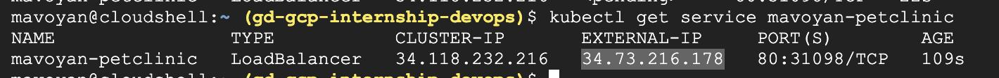

# Documentation

## The task

Complete the following steps using the documentation provided in the Learning Path:

1. Deploy the java spring-petclinic application with Kubernetes deployment.
2. Create Kubernetes service for your application.
3. Expose it to the public through Ingress or LoadBalancer.
4. Create volumes, and secrets if there is a need. (Use managed Kubernetes solutions such as AKS, GKE, or EKS)

Optional:<br/>
 - Prerequisite: do Helm Deep Dive V3 course.
1. Wrap the Kubernetes application manifests in a Helm chart.
2. Deploy the application with a Helm Chart.

## Steps

Go to the GCP console and open the Cloud Shell

Set the project just in case
```
gcloud config set project gd-gcp-internship-devops
```
Create cluster
```
gcloud container clusters create-auto mavoyan-petclinic-cluster \
    --location=us-east1
```
After creating your cluster, you need to get authentication credentials to interact with the cluster:

```
gcloud container clusters get-credentials mavoyan-petclinic-cluster \
    --location us-east1
```
Create deployment with image on GAR
```
kubectl create deployment mavoyan-petclinic \
    --image=us-east1-docker.pkg.dev/gd-gcp-internship-devops/mavoyan-springrepo/spring-app:latest
```
Exose with Load LoadBalancer
```
kubectl expose deployment mavoyan-petclinic \
    --type LoadBalancer \
    --port 80 \
    --target-port 8080
```
Wait till Exteral IP will apear and get it with this command
```
kubectl get service mavoyan-petclinic
```

Result:


To delete service:
```
kubectl delete service mavoyan-petclinic
```
To delete the cluster:
```
gcloud container clusters delete mavoyan-petclinic-cluster \
    --location us-east1
```
