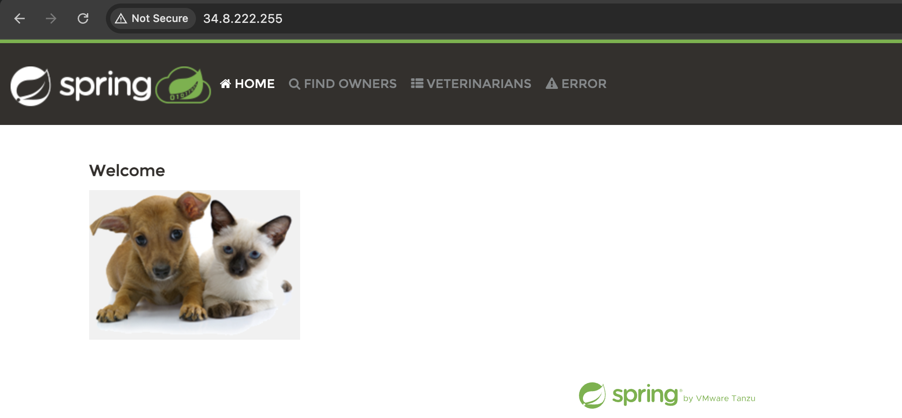

# Documentation

## The task

Complete the following steps using the documentation provided in the Learning Path:

1. Deploy the java spring-petclinic application with Kubernetes deployment.
2. Create Kubernetes service for your application.
3. Expose it to the public through Ingress or LoadBalancer.
4. Create volumes, and secrets if there is a need. (Use managed Kubernetes solutions such as AKS, GKE, or EKS)

Optional:<br/>
 - Prerequisite: do Helm Deep Dive V3 course.
1. Wrap the Kubernetes application manifests in a Helm chart.
2. Deploy the application with a Helm Chart.

## Steps

At first we need to create GKE cluster in gcp using terraform
```
Clone this project git clone -b k8s git@github.com:nlopatin-gd/mavoyan-internship.git
```
Go to desired directory
```
cd k8s cd k8s/terraform/
```
Apply infrastructure
```
terraform init
terraform validate
terraform plan
terraform apply
```
Get credentials in your terminal
```
gcloud container clusters get-credentials mavoyan-cluster \
    --location us-east1
```
Cd to directory with yaml files
```
cd ..
```
Create namespace for our resources
```
kubectl create namespace mavoyan-namespace
```
Apply yaml files (Note: first one should be secret.yaml)
```
kubectl apply -f secret.yaml
kubectl apply -f dbdeployment.yaml
kubectl apply -f dbservice.yaml
kubectl apply -f appdeployment.yaml
kubectl apply -f appservice.yaml
kubectl apply -f appingress.yaml
```
To see our resources use this command
```
kubectl get all -n mavoyan-namespace 
```
Then we can get the IP address from here
```
kubectl get ingress -n mavoyan-namespace
```

And open in browser


### App-DB Connection Test 


At first we need to do port-forwarding for db.
```
kubectl port-forward service/demo-db 5432:5432 -n mavoyan-namespace
```


Now we can connect to db from our local terminal
```
psql -h localhost -p 5432 -U user -d petclinic
```


In web app we can find where we can do chagnes in db

Tables in DB
```
\dt
```

Before doing changes lets print the content of owners table.
```
TABLE owners;
```

Now let's do changes with adding owner

Result:


### DB-App Connection Test  

For testing from other side we can remove user with id 11 from db.
```
DELETE FROM owners WHERE id=11;
```

Result:
