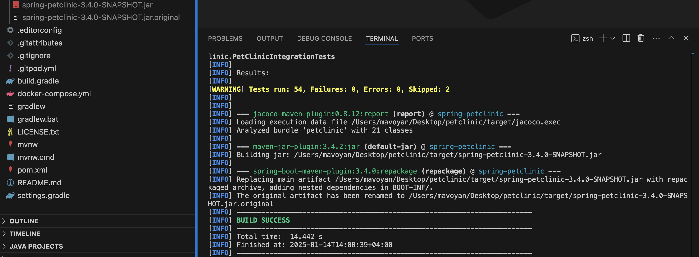

# Documentation

## The task

1. Install locally the latest versions of Java and Maven. 
Java Downloads | Oracle
Download Apache Maven 
2. ​Go to https://github.com/spring-projects/spring-petclinic, fork it and clone the forked repo.
3. Perform validation to check if the project is correct.
4. Build JAR artifact from source code, run the application locally and see the web interface in the browser.
5. Increase project Major version (e.g. from 3.2.0 to 4.0.0) without interactive mode. Use release plugin.
6. In the pom file add <scm> section with your repo address. Prepare code to release.
7. Try to prepare a release in non-interactive mode.
8. Try to perform the release of artifacts.
9. Perform release cleanup.

## Steps

1. Install locally the latest versions of Java and Maven.
Java Downloads | Oracle
Download Apache Maven <br/>

To download Java and Apache Maven
```
curl -O https://download.oracle.com/java/23/latest/jdk-23_macos-aarch64_bin.dmg
curl -O https://dlcdn.apache.org/maven/maven-3/3.9.9/binaries/apache-maven-3.9.9-bin.tar.gz
```
Install Java and extract maven
```
tar -xzvf apache-maven-3.9.9-bin.tar.gz
```
Add maven to path with the following code in home directory.
```
sudo mv apache-maven-3.9.9 /usr/local

echo "export MAVEN_HOME=/usr/local/apache-maven-3.9.9
export PATH=\$MAVEN_HOME/bin:\$PATH" >> ~/.zprofile

source ~/.zprofile
```
To ensure everything is installed
```
java -version
mvn -v
```
<br/>
​2. ​Go to https://github.com/spring-projects/spring-petclinic, fork it and clone the forked repo. <br/>

Fork repo and clone that
```
git clone git@github.com:<username>/spring-petclinic.git
```
<br/>
4. Build JAR artifact from source code, run the application locally and see the web interface in the browser. <br/>

Building JAR artifact from source code
```
mvn clean package
```


Pay attention to the left angle of the top to see the version.
<br/>
To run the application run the following command
```
java -jar target/spring-petclinic-3.4.0-SNAPSHOT.jar
```
<br/>
Now to see the reusult go to http://localhost:8080 
<br/>

5. Increase project Major version (e.g. from 3.2.0 to 4.0.0) without interactive mode. Use release plugin.
<br/>
To do this I have read this documentation https://maven.apache.org/maven-release/maven-release-plugin/usage/non-interactive-release.html

<br/>
At first we need to add Release Plugin to our pom.xml file

```
<plugin>
        <groupId>org.apache.maven.plugins</groupId>
        <artifactId>maven-release-plugin</artifactId>
        <version>3.1.1</version>
</plugin>
```


First command to execute to prevent the Release Plugin from prompting the user for any information

```
mvn -B release:prepare
```

We are receiving this error

<br/>
To fix this we should add scm configuration to our pom.xml file
```
<scm>
    <developerConnection>scm:git:git@github.com:<username>/spring-petclinic.git</developerConnection>
</scm>
```


We need to commit our changes to avoid this error


```
git add . # use the file names instead of .
git commit -m "commit message"
```
<br/>
We need to run this command once again.
```
mvn -B release:prepare
```


<br/>
Next step:

```
mvn --batch-mode -Dtag=my-proj-4.0.0 release:prepare \
                 -DreleaseVersion=4.0.0 \
                 -DdevelopmentVersion=4.0.1-SNAPSHOT
```


<br/>
The important part from the screeshot above
<br/>
- You can now continue with release:perform, or start again using the -Dresume=false flag
So lets execute this command

```
mvn --batch-mode -Dtag=my-proj-4.0.0 release:prepare \
                 -DreleaseVersion=4.0.0 \
                 -DdevelopmentVersion=4.0.1-SNAPSHOT -Dresume=false
```
Result:


8.Try to perform the release of artifacts.

For this step I have added some configurations in pom.xml file

```
<scm>
    <connection>scm:git:https://github.com/<username>/spring-petclinic.git</connection>
    <developerConnection>scm:git:https://github.com/<username>/spring-petclinic.git</developerConnection>
    <url>https://github.com/<username>/spring-petclinic</url>
  </scm>
```
And changed release plugin part
```
<plugin>
        <groupId>org.apache.maven.plugins</groupId>
        <artifactId>maven-release-plugin</artifactId>
        <version>3.1.1</version>
        <configuration>
          <releaseProfiles>release</releaseProfiles>
          <goals>install</goals>
          <autoVersionSubmodules>true</autoVersionSubmodules>
          <checkModificationExcludes>
              <checkModificationExclude>pom.xml</checkModificationExclude>
              <checkModificationExclude>**</checkModificationExclude>
          </checkModificationExcludes>
        </configuration>
      </plugin>
```

The next steps are

```
 mvn --batch-mode -Dtag=my-proj-4.0.0 release:prepare \
                 -DreleaseVersion=4.0.0 \
                 -DdevelopmentVersion=4.0.1-SNAPSHOT -Dresume=false
mvn release:clean release:prepare
mvn -X release:perform
```
The result:


9. Perform release cleanup.
<br/>
To do this I used this command

```
mvn release:cleanup
```


