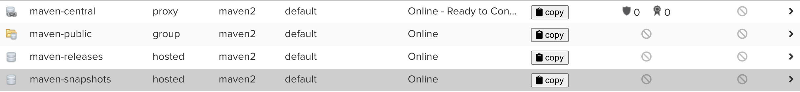

# Documentation

## Task
1. Install Nexus
2. Configure admin user
3. Configure proxy repo <br/>
    a) For Maven: Create setting.xml, maven should use it as mirror <br/>
4. Upload spring-petclinic Artifact to Nexus<br/>
    a)For Maven: Use the deploy plugin in your pom.xml. You should be able to upload your artifacts to Nexus using Maven.<br/>
5. Search artifacts in Nexus

## Steps

1. Install Nexus

    To download Nexus and extract

    ```
    curl -L -o nexus.tar.gz https://sonatype-download.global.ssl.fastly.net/repository/downloads-prod-group/3/nexus-3.76.0-03-java17-mac.tgz
    tar -xzvf nexus.tar.gz
    ```
    
    Move to bin directory

    ```
    cd nexus-3.76.0-03/bin 
    ```
    Run Nexus
    ```
    ./nexus run
    ```
    Open http://localhost:8081 to see Nexus

<br/>

2. Configure admin user.<br/>
    Click on Sign In button.<br/>
    
    <br/>
    Here we can sign in as admin. The username is admin and we can get the password with this command. (From Nexus directory)

    ```
    cat sonatype-work/nexus3/admin.password
    ```
    Then in account page we can change First Name, Last Name, email and password.
    
3. Configure proxy repo <br/>
    a) For Maven: Create setting.xml, maven should use it as mirror <br/>
    https://www.sonatype.com/blog/using-sonatype-nexus-repository-3-part-1-maven-artifacts
    <br/>

    We can use default repositories in Nexus
    

    We need to add some configurations to ~/.m2/settings.xml file.<br/>

    Configurations of ~/.m2/settings.xml <br/>

    Best practice to use separate user for this
    ```
        <?xml version="1.0" encoding="UTF-8"?>
    <settings xmlns="http://maven.apache.org/SETTINGS/1.1.0"
    xmlns:xsi="http://www.w3.org/2001/XMLSchema-instance"
    xsi:schemaLocation="http://maven.apache.org/SETTINGS/1.1.0 http://maven.apache.org/xsd/settings-1.1.0.xsd">

    <servers>
        <server>
        <id>nexus-snapshots</id>
        <username>admin</username>
        <password>change_this</password>
        </server>
        <server>
        <id>nexus-releases</id>
        <username>admin</username>
        <password>change_this</password>
        </server>
    </servers>

    <mirrors>
        <mirror>
        <id>central</id>
        <name>central</name>
        <url>http://localhost:8081/repository/maven-group/</url>
        <mirrorOf>*</mirrorOf>
        </mirror>
    </mirrors>

    </settings>
    ```

4. Upload spring-petclinic Artifact to Nexus<br/>
    a)For Maven: Use the deploy plugin in your pom.xml. You should be able to upload your artifacts to Nexus using Maven.<br/>

    For this step we need to add this to our project's pom.xml file

    ```
    <distributionManagement>
      <snapshotRepository>
        <id>nexus-snapshots</id>
        <url>http://localhost:8081/repository/maven-snapshots/</url>
      </snapshotRepository>
      <repository>
        <id>nexus-releases</id>
        <url>http://localhost:8081/repository/maven-releases/</url>
      </repository>
    </distributionManagement>
    ```
    And this in plugins section
    ```
    <plugin>
                <groupId>org.apache.maven.plugins</groupId>
                <artifactId>maven-deploy-plugin</artifactId>
                <version>2.8.1</version> <!-- You can use a newer version if needed -->
                <executions>
                    <execution>
                        <goals>
                            <goal>deploy</goal> <!-- Deploy goal is used for deployment -->
                        </goals>
                        <configuration>
                            <!-- Customize the deployment process if needed -->
                        </configuration>
                    </execution>
                </executions>
            </plugin>
      <plugin>
    ```
    The last step 
    ```
    mvn install
    mvn deploy -Dmaven.test.skip=true
    ```

5. Search artifacts in Nexus
    
