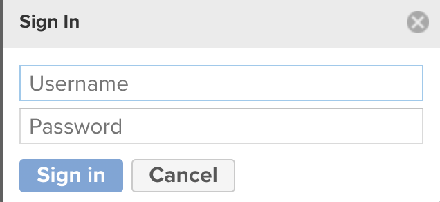
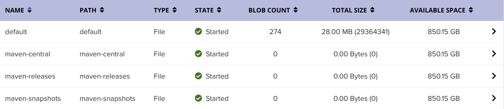
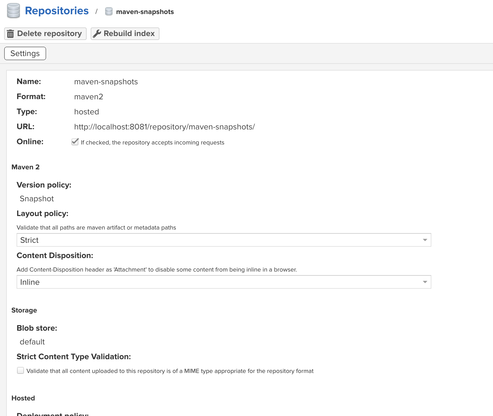
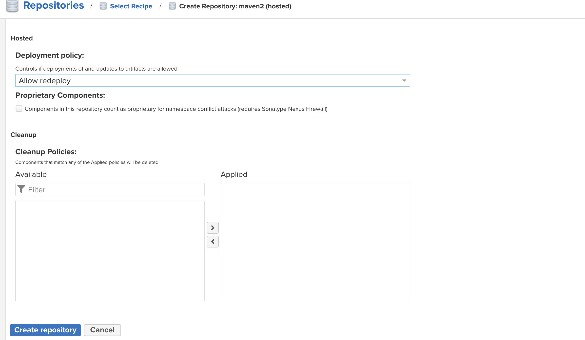
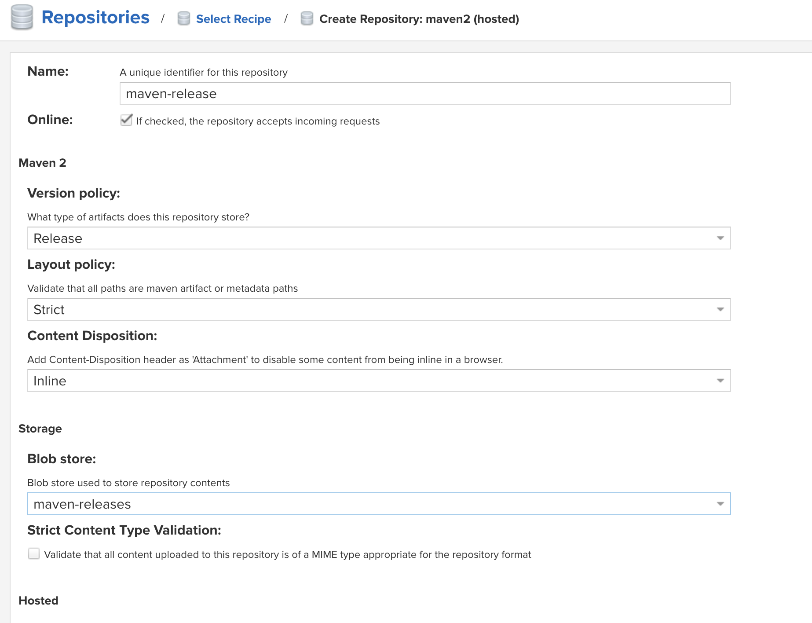
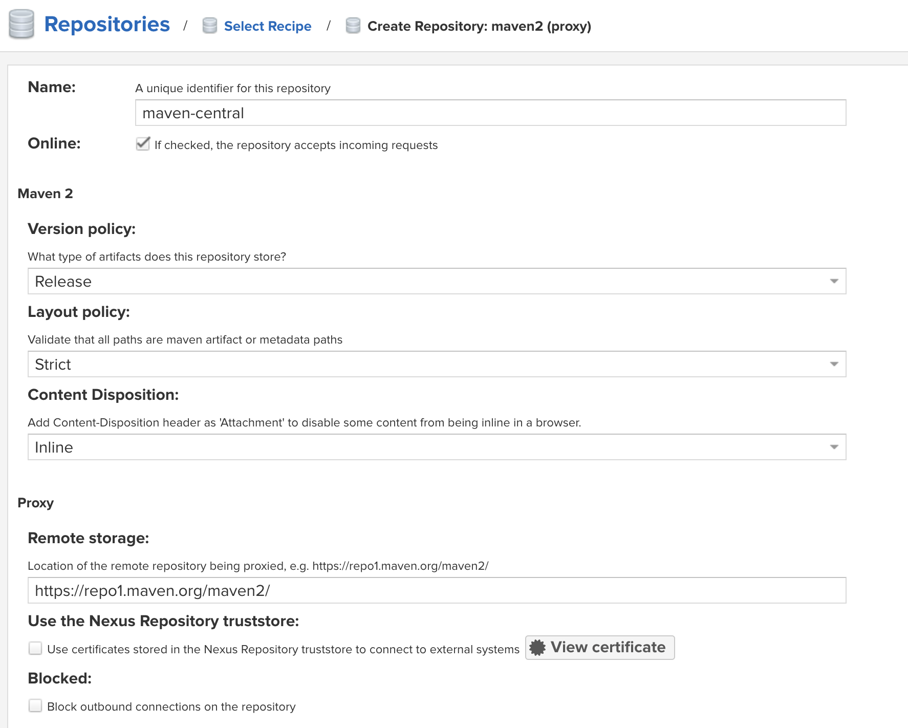
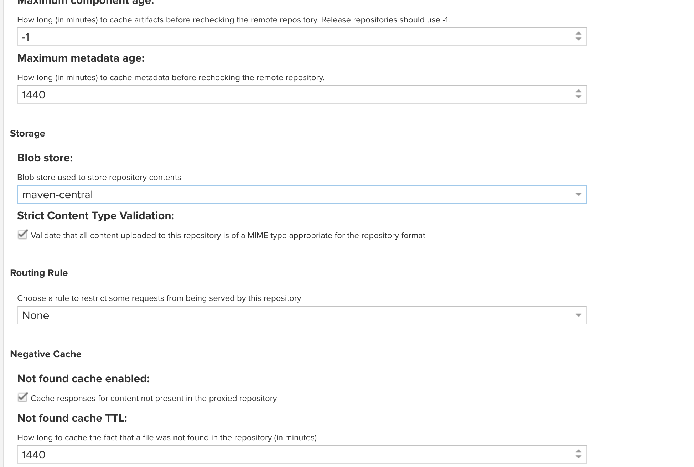
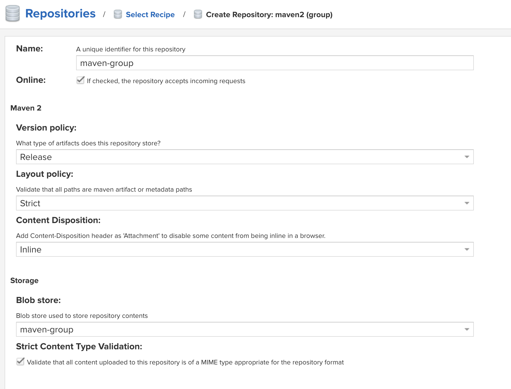
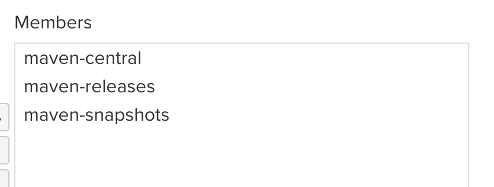
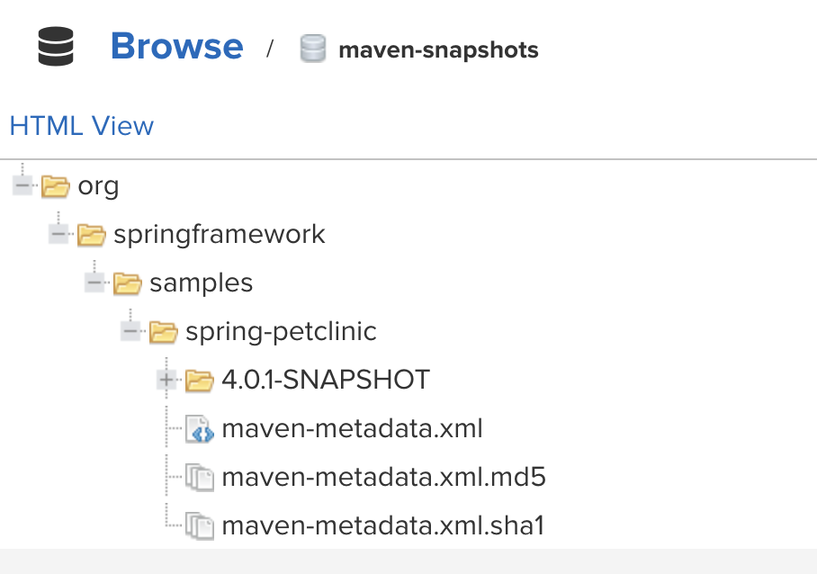

# Documentation

## Task
1. Install Nexus
2. Configure admin user
3. Configure proxy repo <br/>
    a) For Maven: Create setting.xml, maven should use it as mirror <br/>
4. Upload spring-petclinic Artifact to Nexus<br/>
    a)For Maven: Use the deploy plugin in your pom.xml. You should be able to upload your artifacts to Nexus using Maven.<br/>
5. Search artifacts in Nexus

## Steps

1. Install Nexus

    To download Nexus and extract

    ```
    curl -L -o nexus.tar.gz https://download.sonatype.com/nexus/3/nexus-3.42.0-01-unix.tar.gz
    tar -xzvf nexus-3.76.0-03-java17-mac.tgz
    ```
    
    Move to bin directory

    ```
    cd nexus-3.76.0-03/bin/
    ```
    Run Nexus
    ```
    ./nexus run
    ```
    Open http://localhost:8081 to see Nexus

<br/>

2. Configure admin user.<br/>
    Click on Sign In button.<br/>
    
    <br/>
    Here we can sign in as admin. The username is admin and we can get the password with this command. (From Nexus directory)

    ```
    cat sonatype-work/nexus3/admin.password
    ```
    Then in account page we can change First Name, Last Name, email and password.
    
3. Configure proxy repo <br/>
    a) For Maven: Create setting.xml, maven should use it as mirror <br/>
    https://www.sonatype.com/blog/using-sonatype-nexus-repository-3-part-1-maven-artifacts
    <br/>

    In Nexus we need to create some blob stores and repositories.<br/>
    I have created three blob stores
    
    Then we need to add repositories<br/>
    First one
    
    
    Second
    
    
    And third 
    
    
    The group repository with it's blob store.
    
    

    We need to add some configurations to ~/.m2/settings.xml file.<br/>
    But before that we can configure ~/.m2/settings-security.xml file for making safe our passwords.<br/>
    Following this Documentation https://maven.apache.org/guides/mini/guide-encryption.html <br/><br/>
    Master-password
    ```
    mvn --encrypt-master-password <password>
    ```
    ```
    echo "<settingsSecurity>
    <master>{change_this_to_master_password}</master>
        </settingsSecurity>" > ~/.m2/settings-security.xml
    ```
    Password
    ```
    mvn --encrypt-password <password>
    ```
    Configurations of ~/.m2/settings.xml <br/>
    Best practice to use separate user for this
    ```
        <?xml version="1.0" encoding="UTF-8"?>
    <settings xmlns="http://maven.apache.org/SETTINGS/1.1.0"
    xmlns:xsi="http://www.w3.org/2001/XMLSchema-instance"
    xsi:schemaLocation="http://maven.apache.org/SETTINGS/1.1.0 http://maven.apache.org/xsd/settings-1.1.0.xsd">

    <servers>
        <server>
        <id>nexus-snapshot</id>
        <username>admin</username>
        <password>change_to_password</password>
        </server>
        <server>
        <id>nexus-release</id>
        <username>admin</username>
        <password>change_to_password</password>
        </server>
    </servers>

    <mirrors>
        <mirror>
        <id>central</id>
        <name>central</name>
        <url>http://localhost:8081/repository/maven-group/</url>
        <mirrorOf>*</mirrorOf>
        </mirror>
    </mirrors>

    </settings>
    ```

4. Upload spring-petclinic Artifact to Nexus<br/>
    a)For Maven: Use the deploy plugin in your pom.xml. You should be able to upload your artifacts to Nexus using Maven.<br/>

    For this step we need to add this to our project's pom.xml file
    In repositories
    ```
    <repository>
      <id>maven-group</id>
      <url>http://localhost:8081/repository/maven-group/</url>
    </repository>
    ```

    ```
    <distributionManagement>
        <snapshotRepository>
        <id>nexus-snapshots</id>
        <url>http://localhost:8081/repository/maven-snapshots/</url>
        </snapshotRepository>
        <repository>
        <id>nexus-releases</id>
        <url>http://localhost:8081/repository/maven-releases/</url>
        </repository>
    </distributionManagement>
    ```

    The last step 
    ```
    mvn install
    mvn deploy
    ```

5. Search artifacts in Nexus
    
