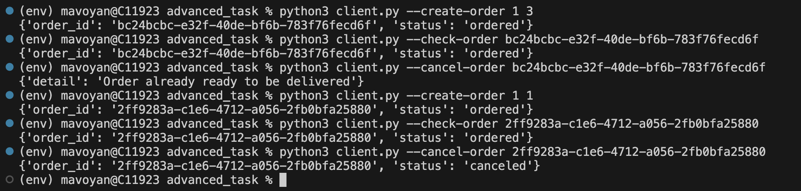

# Documentation

## The task

Task 1 <br/>
1. Create a script that accepts the file name and puts its extension to output. If there is no extension - an exception should be raised.
2. Given a list of integers. Remove duplicates from the list and create a tuple. Find the minimum and maximum number.
3. Create a script that reads the access log from a file. The name of the file is provided as an argument. An output of the script should provide the total number of different User Agents and then provide statistics with the number of requests from each of them. Here is a link to an example access.log file.
4. Given an input string, count occurrences of all characters within a string (e.g. pythonnohtyppy -> p:3, y:3, t:2, h:2, o:2, n:2).
5. Write a script that gets system information like distro info, memory(total, used, free), CPU info (model, core numbers, speed), current user, system load average, and IP address. Use arguments for specifying resources. (For example, -d for distro -m for memory, -c for CPU, -u for user info, -l for load average, -i for IP address).


Task 2: <br/>
Create a script that uses the Survey Monkey (https://www.surveymonkey.com) service, creates a survey.<br/>
PREREQUISITES:<br/>
1. Sign up at https://www.surveymonkey.com 
2. Create a draft application at https://developer.surveymonkey.com   
3. No need to deploy your application. It's just for testing. Do not forget to set permissions for your application.
4. After creating a draft application you will obtain an ACCESS_TOKEN which is needed to do API requests from your script.<br/>

REQUIREMENTS:
<br/>
1. The script should accept a JSON file with questions for the survey and a text file with a list of email addresses.
2. The structure of a JSON file with questions:
```
{

   "Survey_Name": {

      "Page_Name": {

          "Question1_Name": {

              "Description" : "Description of question",

              "Answers" : [

                  "Answer1",

                  "Answer2",

                  "Answer3"

              ]

          },

          "Question2_Name": {

              "Description" : "Description of question",

              "Answers" : [

                  "Answer1",

                  "Answer2",

                  "Answer3"

              ]

          }

          . . .

      }

   }

}
```
3 There should be at least 3 questions and 2 recipients.

### Advanced practical task:
Server Side:

1. Set Up Server: <br/>
Create a server to handle HTTP requests.
2. Define Data Structures:<br/>
Define data structures for pizzas, orders, users, and admin tokens.
3. Customer API Endpoints (Required):<br/>
Implement endpoints for customers:List the menu (GET /menu)
Create order (POST /order)
Check order status (GET /order/{order_id})
Cancel order if status is not ready_to_be_delivered (DELETE /order/{order_id})
4. Admin Authentication (Required):<br/>
Implement token-based admin authentication:Check if the provided token matches the hardcoded admin token.
Allow access to admin methods only if the token is valid.
5. Admin API Endpoints (Optional):<br/>
Implement endpoints for admins:Add pizza to the menu (POST /menu)
Delete pizza from the menu (DELETE /menu/{pizza_id})
Cancel order regardless of status (DELETE /order/{order_id})
6. Token Storage (Optional):<br/>
Store the admin token securely on the server side.
7. User Registration (Optional):<br/>
Implement user registration functionality.
Store user data securely.

Store user data securely.
Client Side (CLI):

Executable CLI:
1. Create an executable CLI file that accepts command-line arguments.
2. Customer CLI Commands (Required):<br/>
Implement CLI commands for customers:List the menu<br/>
Create order <br/>
Check order status <br/>
Cancel order (if not ready_to_be_delivered) 
3. Admin CLI Commands (Optional):<br/>
Implement CLI commands for admins:Add pizza to the menu<br/>
Delete pizza from the menu<br/>
Cancel order (regardless of status)<br/>
4. Admin Token Verification (Required):<br/>
If an admin token is provided for an admin action, send it to the backend for verification.<br/>
Return 401 Unauthorized if the token is not approved.
5. User Registration in CLI (Optional):<br/>
Allow users to register through the CLI.<br/>
Store registration data securely.
6.Address Reuse (Optional):<br/>
Allow users who have registered to make orders without passing their address, using the stored address from registration.

General Guidelines:

Error Handling:
Implement proper error handling for all scenarios.
Provide meaningful error messages for better user understanding.
Security:
Implement secure practices for handling sensitive data like tokens and user information.
Documentation:
Document the API endpoints and CLI commands for easy reference.
Testing:
Implement thorough testing for both API and CLI functionality.
Code Organization:
Organize the code in a modular and readable manner.
Deployment:
Consider deployment strategies for the server.

## Steps to run
[Requirements file link](https://github.com/nlopatin-gd/mavoyan-internship/blob/python/python/requirements.txt) <br/>
Enable virtual environment
```
python3 -m venv env
source env/bin/activate
```
Install requirements 
```
pip install -r requirements.txt
```

[Task 1.1](https://github.com/nlopatin-gd/mavoyan-internship/blob/python/python/task1_1.py)

Command:
```
python3 task1_1.py recipients.txt 
```
Excpected output:
```
Extension(s): ['.txt']
```
Command:
```
python3 task1_1.py recipients.txt.gz
```
Excpected output:
```
Extension(s): ['.txt', '.gz']
```

[Task 1.2](https://github.com/nlopatin-gd/mavoyan-internship/blob/python/python/task1_2.py)

Command:
```
python3 task1_2.py 
```
Excpected output:
```
(1, 2, 3, 4, 5, 56, 90)
90
1
```

[Task 1.3](https://github.com/nlopatin-gd/mavoyan-internship/blob/python/python/task1_3.py)

Command:
```
python3 task1_3.py access.log.5 
```

[Task 1.4](https://github.com/nlopatin-gd/mavoyan-internship/blob/python/python/task1_4.py)

Command:
```
python3 task1_4.py abcdefgabcdefdef
```
Excpected output:
```
abcdefgabcdefdef
a: 2
b: 2
c: 2
d: 3
e: 3
f: 3
g: 1
```

[Task 1.5](https://github.com/nlopatin-gd/mavoyan-internship/blob/python/python/task1_5.py)

Usage:

Distribution Info: 
```
python3 task1_5.py -d
```
Memory Info: 
```
python3 task1_5.py -m
```
CPU Info: 
```
python3 task1_5.py -c
```
Current User:
```
python3 task1_5.py -u
```
Load Average:
```
python3 task1_5.py -l
```
External IP Address:
```
python3 task1_5.py -i
```

[Task 2](https://github.com/nlopatin-gd/mavoyan-internship/blob/python/python/task2.py)

Usage:

```
python3 task2.py ms_questions.json recipients.txt   
```
Result:


### Advanced task
[Server](https://github.com/nlopatin-gd/mavoyan-internship/blob/python/python/advanced_task/server.py)

[Client](https://github.com/nlopatin-gd/mavoyan-internship/blob/python/python/advanced_task/client.py)

Add your admin token:
```
echo "ADMIN_TOKEN=<your-admin-token>" > .env
```
To start server
```
uvicorn server:app --reload
```
We can also visit ``http://127.0.0.1:8000/docs``


Client side:<br/>
Usage:<br/>
List menu:
```
python3 client.py --get-menu
```
Register:
```
python3 client.py --register <user_id> <address>
```

Create Order:
```
python3 client.py --create-order <user_id> <pizza_id>
```

Check Order Status:
```
python3 client.py --check-order <your_order_id>
```

Cancel Order:
```
python3 client.py --cancel-order <your_order_id>
```

Admin Add Pizza:
```
python3 client.py --admin-token <your-admin-token>  --admin-add-pizza <new_pizza_name> <price>
```

Admin Delete Pizza:
```
python3 client.py --admin-token <your-admin-token>  --admin-delete-pizza <pizza_id>  
```

Admin Cancel Order:
```
 python3 client.py --admin-token <your-admin-token> --admin-cancel-order <your_order_id>
```

<br/>
Testing:
<br/>
List menu:
```
python3 client.py --get-menu
```
Result:


Register:
```
python3 client.py --register 1 Bryusov6
```
Result:


Create Order:
```
python3 client.py --create-order 1 2
```
Result:


Check Order Status:
```
python3 client.py --check-order <your_order_id>
```
Result:


Cancel Order:
```
python3 client.py --cancel-order <your_order_id>
```
Result:


Admin Add Pizza:
```
python3 client.py --admin-token your-admin-token --admin-add-pizza new_pizza 78
```
Result:


Admin Delete Pizza:
```
python3 client.py --admin-token your-admin-token --admin-delete-pizza 1  
```
Result:


Admin Cancel Order:
```
 python3 client.py --admin-token your-admin-token --admin-cancel-order <your_order_id>
```
Result:

