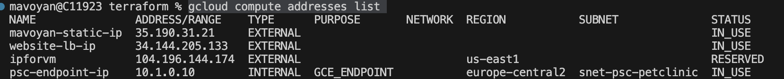

# Documentation

## The task

Create a simple cloud infrastructure using Terraform by following the steps provided below:

1. Everything should be inside Terraform configuration files, manual changes are not allowed.
2. Try to use terraform modules to segregate resources by its types (compute, network).
3. Create a temporary VM with metadata script installing HTTP server (Apache) with a simple website inside.
4. Create an image from a temporary VM.
5. Terraform should create a scale set of 3 instances (use predefined image as source image for VMs), including external load balancer with health checks, everything should be done via terraform tf/tfstate files.
6. Every host should display server number/hostname to ensure that load balancer is working.
7. Users should be able to connect to the website in High Availability mode via external load balancer IP.
8. Add firewall for accessing external load balancer from limited IP addresses range and only for certain ports.
9. Use Public Cloud storage service as backend for Terraform state.

## About IAC

I have created two modules: Compute and Network. In the Compute module, I’ve created a temporary VM with a metadata startup script. This script downloads Apache and PHP, then starts a mini web server that displays the VM's hostname.<br/>
Here is that metadata startup script:
```
sudo apt update
sudo apt install -y apache2
sudo systemctl start apache2
sudo systemctl enable apache2
sudo apt install php libapache2-mod-php -y
sudo rm /var/www/html/index.html
sudo touch /var/www/html/index.php
echo "<?php echo 'Hostname: ' . gethostname(); ?>" | sudo tee /var/www/html/index.php
sudo systemctl restart apache2
```
I created an image and template for the Managed Instance Group (MIG) VMs from the temporary VM. To stop the temporary VM, I used the null_resource in my configuration. Then, I created a MIG with 3 instances. In the Network module, I set up a simple load balancer with the following components: 
- ``forwarding rule``
- ``http proxy``
- ``url map``
- ``backend service``

The MIG is connected to a backend service, and everything is integrated with the network and subnets that I created in the Network module. The state file is being stored in GCP cloud storage(Defined in root main.tf file). All data relations are managed via variables and outputs.

Source: https://cloud.google.com/load-balancing/docs/https/ext-http-lb-tf-module-examples#with_mig_backend_and_custom_headers

### Main commands to use
Exexute this commands step by step
```
terraform init
terraform validate
terraform plan
terraform apply
```
To get IP address of load balancer
```
gcloud compute addresses list
```

Result:


To destroy infrastructure
```
terraform destroy
```


